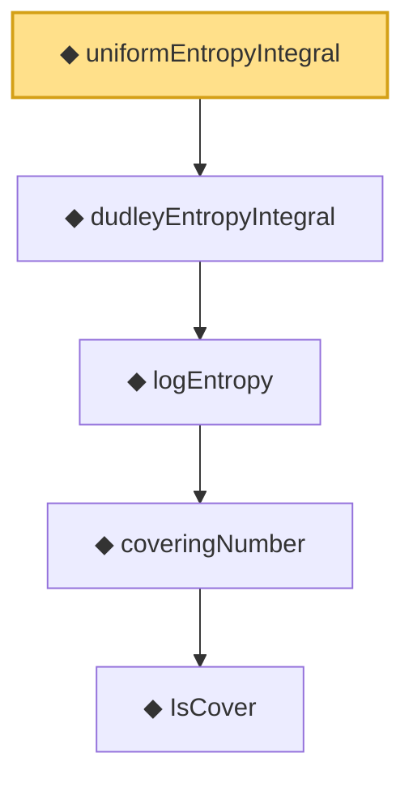

# Proof narrative — uniformEntropyIntegral

Root: **uniformEntropyIntegral** (noncomputable def) `Statlib/StatFoundation/Vocabulary/CoveringNumbers.lean:115` · topic `StatFoundation`
Closure: 5 declarations across 1 files. Generated from `proof_graph.json` — no files were moved.

Reading order (foundations first, headline last):

        ◆ `IsCover` — def · `Statlib/StatFoundation/Vocabulary/CoveringNumbers.lean:75`  _(also used by 12: rkhsBall_exists_sup_cover_le_of_domainCover, rkhsBall_coveringNumber_le_of_domainCover, rkhsBall_coveringNumber_le_of_L2_internal, …)_
      ◆ `coveringNumber` — noncomputable def · `Statlib/StatFoundation/Vocabulary/CoveringNumbers.lean:81`  _(also used by 10: rkhsBall_coveringNumber_le_of_domainCover, rkhsBall_coveringNumber_le_of_L2_internal, rkhsBall_logEntropy_L2_le, …)_
    ◆ `logEntropy` — noncomputable def · `Statlib/StatFoundation/Vocabulary/CoveringNumbers.lean:85`  _(also used by 7: rkhsBall_logEntropy_L2_le, rkhsBall_logEntropyIntegral_truncated_le, rkhsBall_logEntropy_L2_le_of_range, …)_
  ◆ `dudleyEntropyIntegral` — noncomputable def · `Statlib/StatFoundation/Vocabulary/CoveringNumbers.lean:101`  _(also used by 6: rkhsBall_dudleyEntropyIntegral_le, dudleyEntropyIntegral_embedded_subset_le_two, rkhsBall_rademacher_complexity_dudley_le, …)_
◆ `uniformEntropyIntegral` — noncomputable def · `Statlib/StatFoundation/Vocabulary/CoveringNumbers.lean:115` **← headline**

## Dependency diagram

