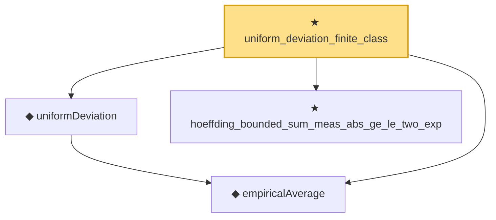

# Proof narrative — uniform_deviation_finite_class

Root: **uniform_deviation_finite_class** (theorem) `Statlib/StatFoundation/EmpiricalProcess/UniformDeviationFiniteClass.lean:10` · topic `StatFoundation`
Closure: 4 declarations across 3 files. Generated from `proof_graph.json` — no files were moved.

Reading order (foundations first, headline last):

  ◆ `empiricalAverage` — noncomputable def · `Statlib/StatFoundation/Vocabulary/EmpiricalProcess.lean:35`  _(also used by 3: empirical_process_bounded_difference, rademacher_generalization_bound, empirical_symmetrization)_
  ◆ `uniformDeviation` — noncomputable def · `Statlib/StatFoundation/Vocabulary/EmpiricalProcess.lean:43`  _(also used by 3: empirical_process_bounded_difference, rademacher_generalization_bound, empirical_symmetrization)_
  ★ `hoeffding_bounded_sum_meas_abs_ge_le_two_exp` — theorem · `Statlib/StatFoundation/Concentration/ExponentialType/hoeffding_bounded_sum_meas_abs_ge_le_two_exp.lean:9`
★ `uniform_deviation_finite_class` — theorem · `Statlib/StatFoundation/EmpiricalProcess/UniformDeviationFiniteClass.lean:10` **← headline**

## Dependency diagram

