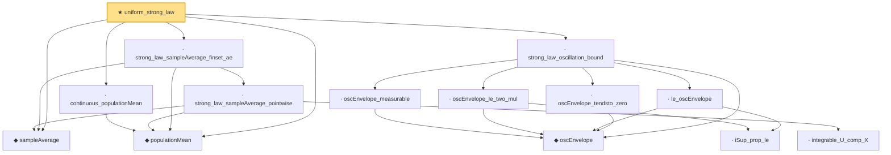

# Proof narrative — uniform_strong_law

Root: **uniform_strong_law** (theorem) `Statlib/StatFoundation/Convergence/LawOfLargeNumbers/UniformStrongLaw.lean:408` · topic `StatFoundation`
Closure: 14 declarations across 1 files. Generated from `proof_graph.json` — no files were moved.

Reading order (foundations first, headline last):

  ◆ `sampleAverage` — noncomputable def · `Statlib/StatFoundation/Convergence/LawOfLargeNumbers/UniformStrongLaw.lean:20`  _(also used by 1: continuous_sampleAverage)_
  ◆ `populationMean` — noncomputable def · `Statlib/StatFoundation/Convergence/LawOfLargeNumbers/UniformStrongLaw.lean:24`
  · `continuous_populationMean` — lemma · `Statlib/StatFoundation/Convergence/LawOfLargeNumbers/UniformStrongLaw.lean:111`
    ◆ `oscEnvelope` — noncomputable def · `Statlib/StatFoundation/Convergence/LawOfLargeNumbers/UniformStrongLaw.lean:154`
    · `oscEnvelope_measurable` — lemma · `Statlib/StatFoundation/Convergence/LawOfLargeNumbers/UniformStrongLaw.lean:294`
      · `iSup_prop_le` — lemma · `Statlib/StatFoundation/Convergence/LawOfLargeNumbers/UniformStrongLaw.lean:143`
    · `oscEnvelope_le_two_mul` — lemma · `Statlib/StatFoundation/Convergence/LawOfLargeNumbers/UniformStrongLaw.lean:222`
    · `le_oscEnvelope` — lemma · `Statlib/StatFoundation/Convergence/LawOfLargeNumbers/UniformStrongLaw.lean:161`
    · `oscEnvelope_tendsto_zero` — lemma · `Statlib/StatFoundation/Convergence/LawOfLargeNumbers/UniformStrongLaw.lean:241`
  · `strong_law_oscillation_bound` — lemma · `Statlib/StatFoundation/Convergence/LawOfLargeNumbers/UniformStrongLaw.lean:307`
      · `integrable_U_comp_X` — lemma · `Statlib/StatFoundation/Convergence/LawOfLargeNumbers/UniformStrongLaw.lean:29`
    · `strong_law_sampleAverage_pointwise` — lemma · `Statlib/StatFoundation/Convergence/LawOfLargeNumbers/UniformStrongLaw.lean:58`
  · `strong_law_sampleAverage_finset_ae` — lemma · `Statlib/StatFoundation/Convergence/LawOfLargeNumbers/UniformStrongLaw.lean:91`
★ `uniform_strong_law` — theorem · `Statlib/StatFoundation/Convergence/LawOfLargeNumbers/UniformStrongLaw.lean:408` **← headline**

## Dependency diagram

