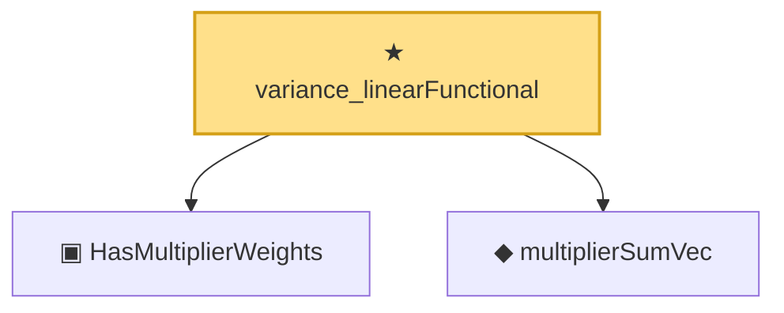

# Proof narrative — variance_linearFunctional

Root: **variance_linearFunctional** (theorem) `Statlib/StatFoundation/Convergence/Resampling/BootstrapInterface.lean:349` · topic `StatFoundation`
Closure: 3 declarations across 2 files. Generated from `proof_graph.json` — no files were moved.

Reading order (foundations first, headline last):

  ▣ `HasMultiplierWeights` — structure · `Statlib/StatFoundation/Vocabulary/Resampling.lean:44`  _(also used by 5: bootstrapMaxLaw_isProbabilityMeasure, bootstrap_coverage_from_distance_and_anticonc, multiplierSumVec_mean_zero, …)_
  ◆ `multiplierSumVec` — noncomputable def · `Statlib/StatFoundation/Vocabulary/Resampling.lean:55`  _(also used by 6: bootstrapMaxLaw_isProbabilityMeasure, multiplierSumVec_mean_zero, multiplierSumVec_covariance_eq_sampleGram, …)_
★ `variance_linearFunctional` — theorem · `Statlib/StatFoundation/Convergence/Resampling/BootstrapInterface.lean:349` **← headline**

## Dependency diagram

