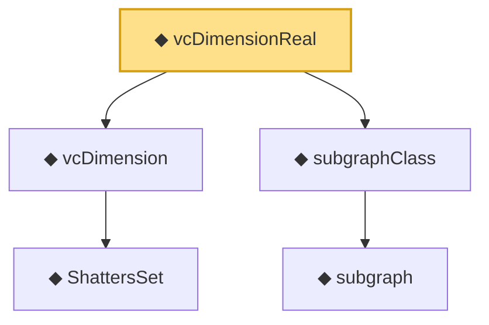

# Proof narrative — vcDimensionReal

Root: **vcDimensionReal** (noncomputable def) `Statlib/StatFoundation/Vocabulary/VCDimension.lean:100` · topic `StatFoundation`
Closure: 5 declarations across 1 files. Generated from `proof_graph.json` — no files were moved.

Reading order (foundations first, headline last):

    ◆ `ShattersSet` — def · `Statlib/StatFoundation/Vocabulary/VCDimension.lean:43`  _(also used by 3: HasVCDimensionLe, HasVCDimensionRealLe, sauer_shelah_sum_bound)_
  ◆ `vcDimension` — noncomputable def · `Statlib/StatFoundation/Vocabulary/VCDimension.lean:48`
    ◆ `subgraph` — def · `Statlib/StatFoundation/Vocabulary/VCDimension.lean:83`
  ◆ `subgraphClass` — def · `Statlib/StatFoundation/Vocabulary/VCDimension.lean:87`  _(also used by 3: HasVCDimensionRealLe, growthFunctionReal, growth_function_real_le_sauer_shelah)_
◆ `vcDimensionReal` — noncomputable def · `Statlib/StatFoundation/Vocabulary/VCDimension.lean:100` **← headline**

## Dependency diagram

