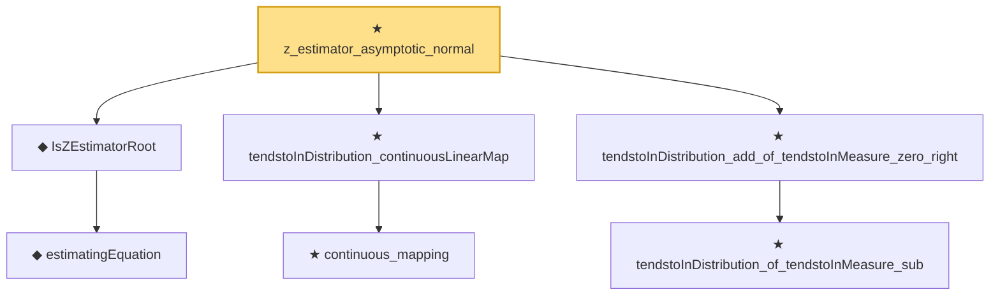

# Proof narrative — z_estimator_asymptotic_normal

Root: **z_estimator_asymptotic_normal** (theorem) `Statlib/StatFoundation/Statistics/Estimation/AsymptoticLinear.lean:1404` · topic `StatFoundation`
Closure: 7 declarations across 4 files. Generated from `proof_graph.json` — no files were moved.

Reading order (foundations first, headline last):

    ◆ `estimatingEquation` — noncomputable def · `Statlib/StatFoundation/Statistics/Estimation/Vocabulary.lean:109`  _(also used by 1: z_estimator_linearization_from_mvt)_
  ◆ `IsZEstimatorRoot` — def · `Statlib/StatFoundation/Statistics/Estimation/Vocabulary.lean:115`  _(also used by 1: z_estimator_linearization_from_mvt)_
    ★ `continuous_mapping` — theorem · `Statlib/StatFoundation/Convergence/AnalysisTools/MappingTheorems.lean:131`  _(also used by 5: tendstoInDistribution_lipschitz, tendstoInDistribution_norm, linear_combination_clt_to_finiteLinearCombination, …)_
  ★ `tendstoInDistribution_continuousLinearMap` — theorem · `Statlib/StatFoundation/Convergence/AnalysisTools/MappingTheorems.lean:153`  _(also used by 1: mestimator_asymptotic_normal)_
    ★ `tendstoInDistribution_of_tendstoInMeasure_sub` — theorem · `Statlib/StatFoundation/Convergence/AnalysisTools/ConvergenceModes.lean:354`  _(also used by 12: tendstoInDistribution_debiasedLasso_scaledCenteredCoordinate_of_scoreCoordinate_and_l1_rowApprox_real, tendstoInDistribution_add_of_tendstoInMeasure_zero_left, tendstoInDistribution_sub_of_tendstoInMeasure_zero_right, …)_
  ★ `tendstoInDistribution_add_of_tendstoInMeasure_zero_right` — theorem · `Statlib/StatFoundation/Convergence/AnalysisTools/ConvergenceModes.lean:476`  _(also used by 1: z_estimator_asymptotic_normal_of_linearization)_
★ `z_estimator_asymptotic_normal` — theorem · `Statlib/StatFoundation/Statistics/Estimation/AsymptoticLinear.lean:1404` **← headline**

## Dependency diagram

