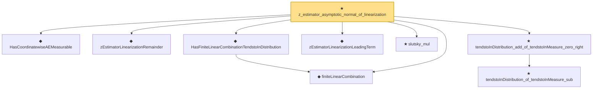

# Proof narrative — z_estimator_asymptotic_normal_of_linearization

Root: **z_estimator_asymptotic_normal_of_linearization** (theorem) `Statlib/StatFoundation/Statistics/Estimation/AsymptoticLinear.lean:56` · topic `StatFoundation`
Closure: 9 declarations across 4 files. Generated from `proof_graph.json` — no files were moved.

Reading order (foundations first, headline last):

  ◆ `HasCoordinatewiseAEMeasurable` — abbrev · `Statlib/StatFoundation/Vocabulary/FiniteCoordinate.lean:33`  _(also used by 46: tendstoInDistribution_debiasedLasso_scaledCenteredFiniteCoordinate_of_linearScore_and_l1_rowApprox_real, tendstoInDistribution_studentizedDebiasedLasso_coordinate_of_linearScore_l1_rowApprox_and_se_real, tendstoInDistribution_debiasedLasso_scaledCenteredFiniteCoordinate_of_scoreVector_and_l1_rowApprox_real, …)_
  ◆ `zEstimatorLinearizationRemainder` — noncomputable def · `Statlib/StatFoundation/Statistics/Estimation/AsymptoticLinear.lean:41`
  ◆ `finiteLinearCombination` — noncomputable abbrev · `Statlib/StatFoundation/Vocabulary/FiniteCoordinate.lean:29`  _(also used by 17: tendstoInDistribution_debiasedLasso_scaledCenteredFiniteCoordinate_of_linearScore_and_l1_rowApprox_real, hasFiniteLinearCombinationIsBigOInProbability_of_coordinatewise_real, hasFiniteLinearCombinationIsLittleOInProbability_of_coordinatewise_real, …)_
  ◆ `HasFiniteLinearCombinationTendstoInDistribution` — abbrev · `Statlib/StatFoundation/Vocabulary/FiniteCoordinate.lean:43`  _(also used by 23: tendstoInDistribution_debiasedLasso_scaledCenteredFiniteCoordinate_of_linearScore_and_l1_rowApprox_real, tendstoInDistribution_studentizedDebiasedLasso_coordinate_of_linearScore_l1_rowApprox_and_se_real, tendstoInDistribution_debiasedLasso_scaledCenteredFiniteCoordinate_of_scoreVector_and_l1_rowApprox_real, …)_
  ◆ `zEstimatorLinearizationLeadingTerm` — noncomputable def · `Statlib/StatFoundation/Statistics/Estimation/AsymptoticLinear.lean:35`
  ★ `slutsky_mul` — theorem · `Statlib/StatFoundation/Convergence/AnalysisTools/MappingTheorems.lean:40`  _(also used by 1: slutsky_div)_
    ★ `tendstoInDistribution_of_tendstoInMeasure_sub` — theorem · `Statlib/StatFoundation/Convergence/AnalysisTools/ConvergenceModes.lean:354`  _(also used by 12: tendstoInDistribution_debiasedLasso_scaledCenteredCoordinate_of_scoreCoordinate_and_l1_rowApprox_real, tendstoInDistribution_add_of_tendstoInMeasure_zero_left, tendstoInDistribution_sub_of_tendstoInMeasure_zero_right, …)_
  ★ `tendstoInDistribution_add_of_tendstoInMeasure_zero_right` — theorem · `Statlib/StatFoundation/Convergence/AnalysisTools/ConvergenceModes.lean:476`  _(also used by 1: z_estimator_asymptotic_normal)_
★ `z_estimator_asymptotic_normal_of_linearization` — theorem · `Statlib/StatFoundation/Statistics/Estimation/AsymptoticLinear.lean:56` **← headline**

## Dependency diagram

