# Proof narrative — z_estimator_linearization_from_mvt

Root: **z_estimator_linearization_from_mvt** (theorem) `Statlib/StatFoundation/Statistics/Estimation/AsymptoticLinear.lean:309` · topic `StatFoundation`
Closure: 27 declarations across 9 files. Generated from `proof_graph.json` — no files were moved.

Reading order (foundations first, headline last):

  ◆ `estimatingEquation` — noncomputable def · `Statlib/StatFoundation/Statistics/Estimation/Vocabulary.lean:109`
  ◆ `IsZEstimatorRoot` — def · `Statlib/StatFoundation/Statistics/Estimation/Vocabulary.lean:115`  _(also used by 1: z_estimator_asymptotic_normal)_
  ★ `tendstoInMeasure_iff_norm` — theorem · `Statlib/StatFoundation/Convergence/AnalysisTools/ConvergenceModes.lean:584`
    ◆ `InProbabilityTailEvent` — def · `Statlib/StatFoundation/Convergence/AnalysisTools/ConvergenceModes.lean:46`  _(also used by 5: t_test_consistent, CompleteConvergence, as_implies_inProbability, …)_
  ◆ `InProbabilityConvergence` — def · `Statlib/StatFoundation/Convergence/AnalysisTools/ConvergenceModes.lean:61`  _(also used by 62: t_test_consistent, inProbabilityConvergence_iff_tendstoInMeasure, inProbabilityConvergence_subseq, …)_
  ★ `inProbabilityConvergence_of_tendstoInMeasure` — theorem · `Statlib/StatFoundation/Convergence/AnalysisTools/ConvergenceModes.lean:712`  _(also used by 6: inProbabilityConvergence_iff_tendstoInMeasure, inProbabilityConvergence_subseq, inProbabilityConvergence_of_inLpConvergence, …)_
  ★ `inProbabilityConvergence_add` — theorem · `Statlib/StatFoundation/Convergence/AnalysisTools/StochasticOrder/ConvergenceBridges.lean:218`
    ★ `tendstoInMeasure_iff_dist` — theorem · `Statlib/StatFoundation/Convergence/AnalysisTools/ConvergenceModes.lean:574`  _(also used by 3: tendstoInMeasure_lipschitz, tendstoInMeasure_const_of_rescaled_tendstoInDistribution, remainder_tendstoInMeasure)_
  ★ `tendstoInMeasure_of_inProbabilityConvergence` — theorem · `Statlib/StatFoundation/Convergence/AnalysisTools/ConvergenceModes.lean:696`  _(also used by 8: inProbabilityConvergence_iff_tendstoInMeasure, inProbabilityConvergence_subseq, inProbability_implies_subseq_as, …)_
  ★ `inProbabilityConvergence_neg` — theorem · `Statlib/StatFoundation/Convergence/AnalysisTools/StochasticOrder/ConvergenceBridges.lean:201`
  ★ `inProbabilityConvergence_sub` — theorem · `Statlib/StatFoundation/Convergence/AnalysisTools/StochasticOrder/ConvergenceBridges.lean:284`  _(also used by 3: isLittleOInProbability_one_sub_of_inProbabilityConvergence, inProbabilityConvergence_sub_of_isBigOInProbability_tendsto_zero_left, inProbabilityConvergence_sub_of_isBigOInProbability_tendsto_zero_right)_
  ★ `tendstoInMeasure_inv_of_ne_zero` — theorem · `Statlib/StatFoundation/Convergence/AnalysisTools/MappingTheorems.lean:61`  _(also used by 1: slutsky_div)_
  ◆ `IsBigOInProbability` — def · `Statlib/StatFoundation/Vocabulary/StochasticOrder.lean:48`  _(also used by 53: isBigOInProbability_add, isBigOInProbability_smul_rate, isBigOInProbability_mul_rate, …)_
  ◆ `IsLittleOInProbability` — def · `Statlib/StatFoundation/Vocabulary/StochasticOrder.lean:58`  _(also used by 44: isLittleOInProbability_add, isLittleOInProbability_smul_rate, isLittleOInProbability_mul_rate, …)_
      ★ `isLittleOInProbability_one_iff_tendstoInMeasure_zero` — theorem · `Statlib/StatFoundation/Convergence/AnalysisTools/StochasticOrder/Basic.lean:201`  _(also used by 4: tendstoInDistribution_debiasedLasso_scaledCenteredFiniteCoordinate_of_linearScore_and_l1_rowApprox_real, tendstoInDistribution_debiasedLasso_scaledCenteredCoordinate_of_scoreCoordinate_and_l1_rowApprox_real, tendstoInMeasure_zero_of_isBigOInProbability_tendsto_zero, …)_
    ★ `isLittleOInProbability_one_of_inProbabilityConvergence_zero` — theorem · `Statlib/StatFoundation/Convergence/AnalysisTools/StochasticOrder/ConvergenceBridges.lean:82`  _(also used by 4: inProbabilityConvergence_add_of_inProbabilityConvergence_zero_left, inProbabilityConvergence_add_of_inProbabilityConvergence_zero_right, isLittleOInProbability_one_sub_of_inProbabilityConvergence, …)_
    ★ `isLittleOInProbability_mul_isBigOInProbability` — theorem · `Statlib/StatFoundation/Convergence/AnalysisTools/StochasticOrder/AlgebraProductMixedLittleBig.lean:11`
  ★ `isLittleOInProbability_mul_of_inProbabilityConvergence_zero_left` — theorem · `Statlib/StatFoundation/Convergence/AnalysisTools/StochasticOrder/SlutskyProduct.lean:16`  _(also used by 1: isLittleOInProbability_mul_of_isBigOInProbability_tendsto_zero_left)_
  ★ `isLittleOInProbability_implies_inProbabilityConvergence_zero` — theorem · `Statlib/StatFoundation/Convergence/AnalysisTools/StochasticOrder/ConvergenceBridges.lean:17`  _(also used by 2: inProbabilityConvergence_zero_of_isBigOInProbability_tendsto_zero, inProbabilityConvergence_zero_of_isLittleOInProbability_rate_isBigO_one)_
  ★ `isLittleOInProbability_one_iff_inProbabilityConvergence_zero` — theorem · `Statlib/StatFoundation/Convergence/AnalysisTools/StochasticOrder/ConvergenceBridges.lean:103`
      ★ `tendstoInMeasure_congr_right` — theorem · `Statlib/StatFoundation/Convergence/AnalysisTools/ConvergenceModes.lean:839`
    ★ `inProbabilityConvergence_congr_right` — theorem · `Statlib/StatFoundation/Convergence/AnalysisTools/ConvergenceModes.lean:866`
      ★ `tendstoInMeasure_congr_left` — theorem · `Statlib/StatFoundation/Convergence/AnalysisTools/ConvergenceModes.lean:830`  _(also used by 7: tendstoInDistribution_toLp_of_finiteLinearCombination_remainder_tendstoInMeasure_real, tendstoInDistribution_add_of_isBigOInProbability_tendsto_zero_left, tendstoInDistribution_add_of_isBigOInProbability_tendsto_zero_right, …)_
    ★ `inProbabilityConvergence_congr_left` — theorem · `Statlib/StatFoundation/Convergence/AnalysisTools/ConvergenceModes.lean:857`
  ★ `inProbabilityConvergence_congr` — theorem · `Statlib/StatFoundation/Convergence/AnalysisTools/ConvergenceModes.lean:875`
  ★ `tendstoInMeasure_ae_unique` — theorem · `Statlib/StatFoundation/Convergence/AnalysisTools/ConvergenceModes.lean:657`
★ `z_estimator_linearization_from_mvt` — theorem · `Statlib/StatFoundation/Statistics/Estimation/AsymptoticLinear.lean:309` **← headline**

## Dependency diagram

```mermaid
flowchart TD
  n0["◆ estimatingEquation"]
  n1["◆ IsZEstimatorRoot"]
  n2["★ tendstoInMeasure_iff_norm"]
  n3["◆ InProbabilityTailEvent"]
  n4["◆ InProbabilityConvergence"]
  n5["★ inProbabilityConvergence_of_tendstoInMeasure"]
  n6["★ inProbabilityConvergence_add"]
  n7["★ tendstoInMeasure_iff_dist"]
  n8["★ tendstoInMeasure_of_inProbabilityConvergence"]
  n9["★ inProbabilityConvergence_neg"]
  n10["★ inProbabilityConvergence_sub"]
  n11["★ tendstoInMeasure_inv_of_ne_zero"]
  n12["◆ IsBigOInProbability"]
  n13["◆ IsLittleOInProbability"]
  n14["★ isLittleOInProbability_one_iff_tendstoInMeasure_zero"]
  n15["★ isLittleOInProbability_one_of_inProbabilityConvergence_zero"]
  n16["★ isLittleOInProbability_mul_isBigOInProbability"]
  n17["★ isLittleOInProbability_mul_of_inProbabilityConvergence_zero_left"]
  n18["★ isLittleOInProbability_implies_inProbabilityConvergence_zero"]
  n19["★ isLittleOInProbability_one_iff_inProbabilityConvergence_zero"]
  n20["★ tendstoInMeasure_congr_right"]
  n21["★ inProbabilityConvergence_congr_right"]
  n22["★ tendstoInMeasure_congr_left"]
  n23["★ inProbabilityConvergence_congr_left"]
  n24["★ inProbabilityConvergence_congr"]
  n25["★ tendstoInMeasure_ae_unique"]
  n26["★ z_estimator_linearization_from_mvt"]
  n1 --> n0
  n4 --> n3
  n5 --> n4
  n5 --> n3
  n6 --> n4
  n6 --> n3
  n8 --> n4
  n8 --> n7
  n9 --> n4
  n9 --> n3
  n10 --> n4
  n10 --> n9
  n10 --> n6
  n11 --> n7
  n14 --> n13
  n14 --> n2
  n15 --> n4
  n15 --> n13
  n15 --> n7
  n15 --> n3
  n15 --> n14
  n16 --> n13
  n16 --> n12
  n17 --> n4
  n17 --> n12
  n17 --> n13
  n17 --> n15
  n17 --> n16
  n18 --> n13
  n18 --> n4
  n18 --> n14
  n18 --> n3
  n19 --> n13
  n19 --> n4
  n19 --> n18
  n19 --> n15
  n21 --> n4
  n21 --> n5
  n21 --> n20
  n21 --> n8
  n23 --> n4
  n23 --> n5
  n23 --> n22
  n23 --> n8
  n24 --> n4
  n24 --> n21
  n24 --> n23
  n26 --> n1
  n26 --> n0
  n26 --> n2
  n26 --> n4
  n26 --> n5
  n26 --> n6
  n26 --> n8
  n26 --> n10
  n26 --> n11
  n26 --> n12
  n26 --> n13
  n26 --> n17
  n26 --> n19
  n26 --> n9
  n26 --> n24
  n26 --> n25
  n26 --> n18
  class n26 headline;
  classDef headline fill:#ffe08a,stroke:#d4a017,stroke-width:2px;
  classDef axiomNode fill:#ffd0d0,stroke:#c0392b,stroke-dasharray:4 2;
```

