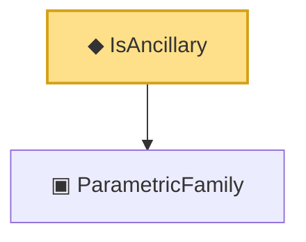

# Proof narrative — IsAncillary

Root: **IsAncillary** (def) `Statlib/Statistic/Basic.lean:48` · topic `Statistic`
Closure: 2 declarations across 1 files. Generated from `proof_graph.json` — no files were moved.

Reading order (foundations first, headline last):

  ▣ `ParametricFamily` — structure · `Statlib/Statistic/Basic.lean:64`  _(also used by 46: CoverageProb, IsConfidenceInterval, IsConfidenceSet, …)_
◆ `IsAncillary` — def · `Statlib/Statistic/Basic.lean:48` **← headline**

## Dependency diagram

