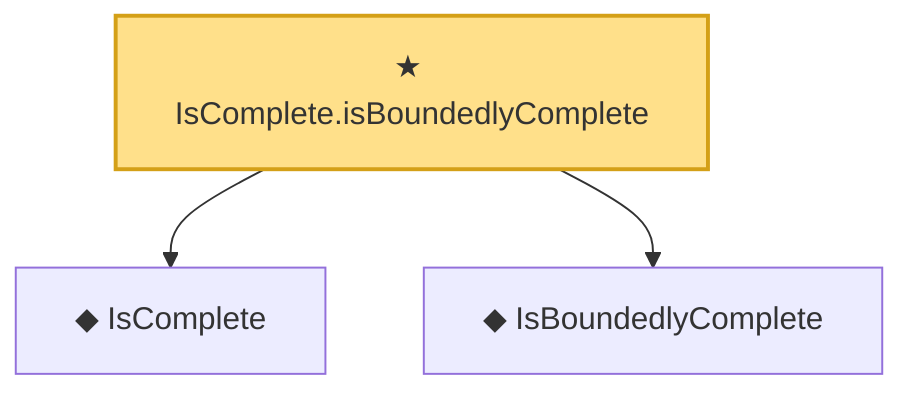

# Proof narrative — IsComplete.isBoundedlyComplete

Root: **IsComplete.isBoundedlyComplete** (theorem) `Statlib/Statistic/Basic.lean:36` · topic `Statistic`
Closure: 3 declarations across 1 files. Generated from `proof_graph.json` — no files were moved.

Reading order (foundations first, headline last):

  ◆ `IsComplete` — def · `Statlib/Statistic/Basic.lean:21`
  ◆ `IsBoundedlyComplete` — def · `Statlib/Statistic/Basic.lean:29`
★ `IsComplete.isBoundedlyComplete` — theorem · `Statlib/Statistic/Basic.lean:36` **← headline**

## Dependency diagram

