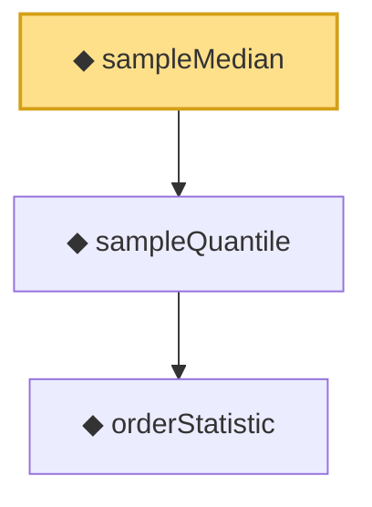

# Proof narrative — sampleMedian

Root: **sampleMedian** (noncomputable def) `Statlib/Statistic/sampleMedian.lean:13` · topic `Statistic`
Closure: 3 declarations across 3 files. Generated from `proof_graph.json` — no files were moved.

Reading order (foundations first, headline last):

    ◆ `orderStatistic` — noncomputable def · `Statlib/Statistic/orderStatistic.lean:13`
  ◆ `sampleQuantile` — noncomputable def · `Statlib/Statistic/sampleQuantile.lean:14`
◆ `sampleMedian` — noncomputable def · `Statlib/Statistic/sampleMedian.lean:13` **← headline**

## Dependency diagram

