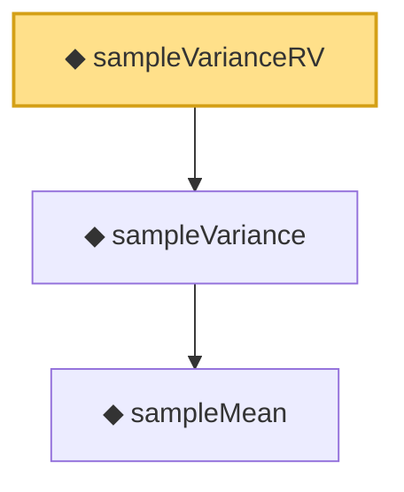

# Proof narrative — sampleVarianceRV

Root: **sampleVarianceRV** (noncomputable def) `Statlib/Statistic/sampleVarianceRV.lean:13` · topic `Statistic`
Closure: 3 declarations across 3 files. Generated from `proof_graph.json` — no files were moved.

Reading order (foundations first, headline last):

    ◆ `sampleMean` — noncomputable def · `Statlib/Statistic/sampleMean.lean:12`
  ◆ `sampleVariance` — noncomputable def · `Statlib/Statistic/sampleVariance.lean:14`
◆ `sampleVarianceRV` — noncomputable def · `Statlib/Statistic/sampleVarianceRV.lean:13` **← headline**

## Dependency diagram

