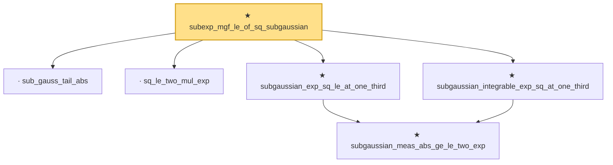

# Proof narrative — subexp_mgf_le_of_sq_subgaussian

Root: **subexp_mgf_le_of_sq_subgaussian** (theorem) `Statlib/SubExponential/subexp_mgf_le_of_sq_subgaussian.lean:72` · topic `SubExponential`
Closure: 6 declarations across 4 files. Generated from `proof_graph.json` — no files were moved.

Reading order (foundations first, headline last):

  · `sub_gauss_tail_abs` — lemma · `Statlib/SubExponential/subexp_mgf_le_of_sq_subgaussian.lean:13`  _(also used by 1: sub_gauss_tail_sq)_
  · `sq_le_two_mul_exp` — lemma · `Statlib/SubGaussian/sq_le_two_mul_exp.lean:10`
    ★ `subgaussian_meas_abs_ge_le_two_exp` — theorem · `Statlib/SubGaussian/subgaussian_meas_abs_ge_le_two_exp.lean:7`  _(also used by 1: subgaussian_even_moment_le)_
  ★ `subgaussian_exp_sq_le_at_one_third` — theorem · `Statlib/SubGaussian/subgaussian_exp_sq_le_at_one_third.lean:14`
  ★ `subgaussian_integrable_exp_sq_at_one_third` — theorem · `Statlib/SubGaussian/subgaussian_exp_sq_le_at_one_third.lean:166`
★ `subexp_mgf_le_of_sq_subgaussian` — theorem · `Statlib/SubExponential/subexp_mgf_le_of_sq_subgaussian.lean:72` **← headline**

## Dependency diagram

