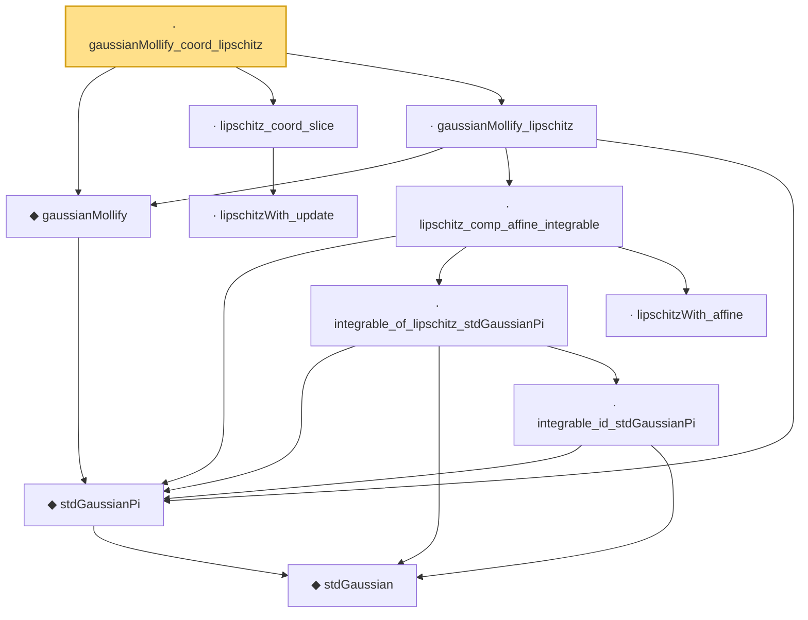

# Proof narrative — gaussianMollify_coord_lipschitz

Root: **gaussianMollify_coord_lipschitz** (lemma) `Statlib/SubGaussian/gaussianMollify_coord_lipschitz.lean:15` · topic `SubGaussian`
Closure: 11 declarations across 8 files. Generated from `proof_graph.json` — no files were moved.

Reading order (foundations first, headline last):

      ◆ `stdGaussian` — abbrev · `Statlib/Gaussian/Basic.lean:29`  _(also used by 95: TensorizationLSIAt, stdGaussianPi_absolutelyContinuous, integrable_mul_gaussianPDFReal_of_memLp, …)_
    ◆ `stdGaussianPi` — def · `Statlib/Gaussian/Basic.lean:32`  _(also used by 64: TensorizationLSIAt, GaussianSobolevRegularity, isProbabilityMeasure_stdGaussianPi, …)_
  ◆ `gaussianMollify` — noncomputable def · `Statlib/SubGaussian/gaussianMollify.lean:18`  _(also used by 5: entropyPi_exp_le_of_lipschitz, gaussianMollify_C1_with_gradient_bound, gaussianMollify_memLp_exp, …)_
    · `lipschitzWith_update` — lemma · `Statlib/SubGaussian/lipschitzWith_update.lean:12`  _(also used by 1: gaussianMollify_C1_with_gradient_bound)_
  · `lipschitz_coord_slice` — lemma · `Statlib/SubGaussian/lipschitz_coord_slice.lean:13`
        · `integrable_id_stdGaussianPi` — lemma · `Statlib/Gaussian/Basic.lean:195`  _(also used by 3: gaussian_ibp_coord, entropyPi_exp_le_of_lipschitz, gaussianMollify_tendsto)_
      · `integrable_of_lipschitz_stdGaussianPi` — lemma · `Statlib/Gaussian/Basic.lean:209`  _(also used by 3: entropyPi_exp_le_of_lipschitz, gaussianMollify_C1_with_gradient_bound, mgf_le_exp_of_lipschitz_stdGaussianPi)_
      · `lipschitzWith_affine` — lemma · `Statlib/SubGaussian/lipschitzWith_affine.lean:13`  _(also used by 1: gaussianMollify_C1_with_gradient_bound)_
    · `lipschitz_comp_affine_integrable` — lemma · `Statlib/SubGaussian/lipschitz_comp_affine_integrable.lean:14`  _(also used by 2: gaussianMollify_C1_with_gradient_bound, gaussianMollify_tendsto)_
  · `gaussianMollify_lipschitz` — lemma · `Statlib/SubGaussian/gaussianMollify_lipschitz.lean:17`  _(also used by 4: entropyPi_exp_le_of_lipschitz, gaussianMollify_C1_with_gradient_bound, gaussianMollify_memLp_exp, …)_
· `gaussianMollify_coord_lipschitz` — lemma · `Statlib/SubGaussian/gaussianMollify_coord_lipschitz.lean:15` **← headline**

## Dependency diagram

