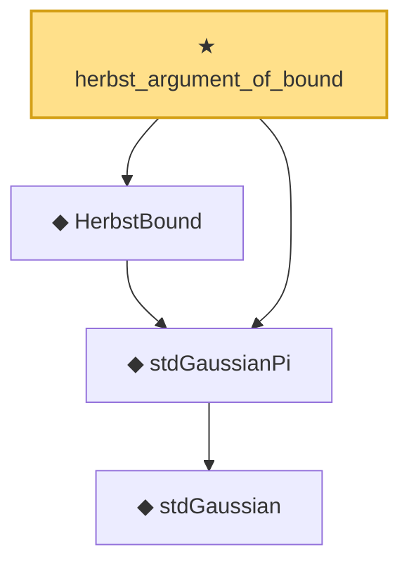

# Proof narrative — herbst_argument_of_bound

Root: **herbst_argument_of_bound** (theorem) `Statlib/SubGaussian/herbst_argument_of_bound.lean:13` · topic `SubGaussian`
Closure: 4 declarations across 3 files. Generated from `proof_graph.json` — no files were moved.

Reading order (foundations first, headline last):

      ◆ `stdGaussian` — abbrev · `Statlib/Gaussian/Basic.lean:29`  _(also used by 97: TensorizationLSIAt, stdGaussianPi_absolutelyContinuous, integrable_mul_gaussianPDFReal_of_memLp, …)_
  ◆ `stdGaussianPi` — def · `Statlib/Gaussian/Basic.lean:32`  _(also used by 67: TensorizationLSIAt, GaussianSobolevRegularity, isProbabilityMeasure_stdGaussianPi, …)_
  ◆ `HerbstBound` — def · `Statlib/SubGaussian/HerbstBound.lean:13`  _(also used by 6: UniversalHerbstBound, gaussian_lipschitz_concentration_of_expIntegrable, gaussian_lipschitz_upper_tail_of_expIntegrable, …)_
★ `herbst_argument_of_bound` — theorem · `Statlib/SubGaussian/herbst_argument_of_bound.lean:13` **← headline**

## Dependency diagram

