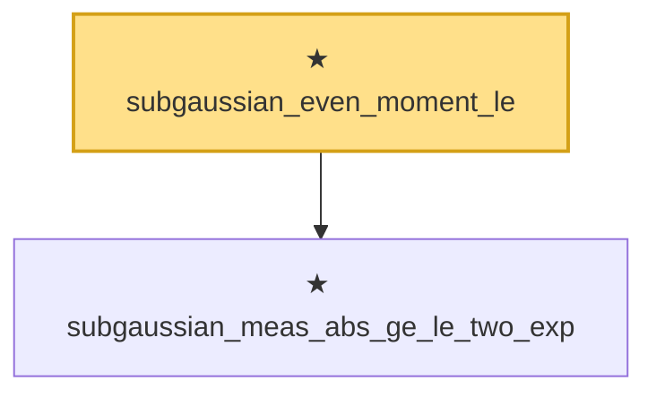

# Proof narrative — subgaussian_even_moment_le

Root: **subgaussian_even_moment_le** (theorem) `Statlib/SubGaussian/subgaussian_even_moment_le.lean:16` · topic `SubGaussian`
Closure: 2 declarations across 2 files. Generated from `proof_graph.json` — no files were moved.

Reading order (foundations first, headline last):

  ★ `subgaussian_meas_abs_ge_le_two_exp` — theorem · `Statlib/SubGaussian/subgaussian_meas_abs_ge_le_two_exp.lean:7`  _(also used by 2: subgaussian_exp_sq_le_at_one_third, subgaussian_integrable_exp_sq_at_one_third)_
★ `subgaussian_even_moment_le` — theorem · `Statlib/SubGaussian/subgaussian_even_moment_le.lean:16` **← headline**

## Dependency diagram

