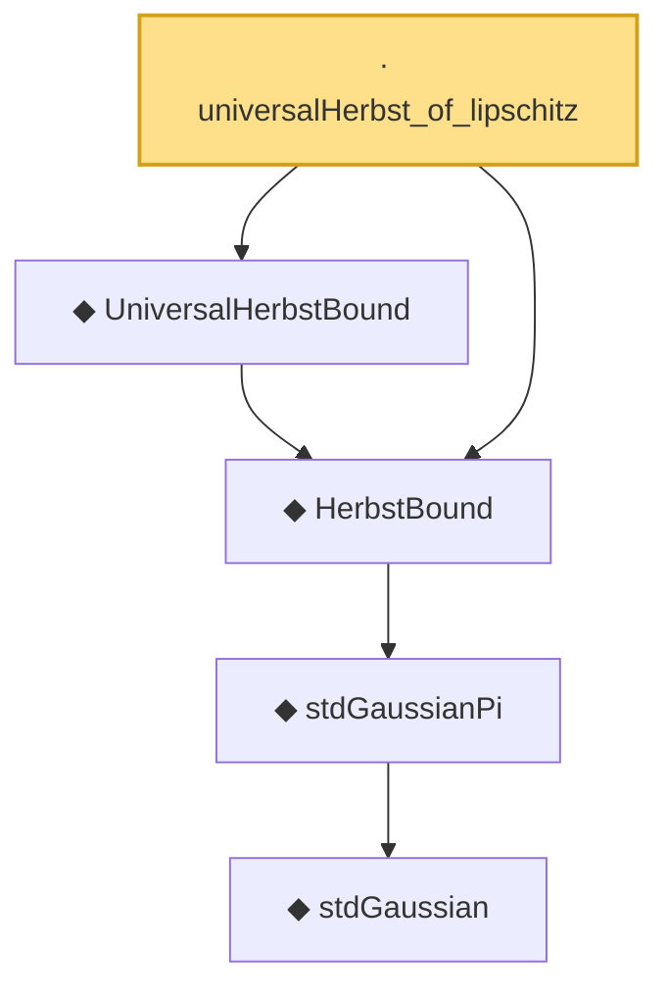

# Proof narrative — universalHerbst_of_lipschitz

Root: **universalHerbst_of_lipschitz** (lemma) `Statlib/SubGaussian/universalHerbst_of_lipschitz.lean:14` · topic `SubGaussian`
Closure: 5 declarations across 4 files. Generated from `proof_graph.json` — no files were moved.

Reading order (foundations first, headline last):

        ◆ `stdGaussian` — abbrev · `Statlib/Gaussian/Basic.lean:29`  _(also used by 97: TensorizationLSIAt, stdGaussianPi_absolutelyContinuous, integrable_mul_gaussianPDFReal_of_memLp, …)_
      ◆ `stdGaussianPi` — def · `Statlib/Gaussian/Basic.lean:32`  _(also used by 68: TensorizationLSIAt, GaussianSobolevRegularity, isProbabilityMeasure_stdGaussianPi, …)_
  ◆ `HerbstBound` — def · `Statlib/SubGaussian/HerbstBound.lean:13`  _(also used by 5: gaussian_lipschitz_concentration_of_expIntegrable, gaussian_lipschitz_upper_tail_of_expIntegrable, herbstBound_neg, …)_
  ◆ `UniversalHerbstBound` — def · `Statlib/SubGaussian/UniversalHerbstBound.lean:14`
· `universalHerbst_of_lipschitz` — lemma · `Statlib/SubGaussian/universalHerbst_of_lipschitz.lean:14` **← headline**

## Dependency diagram

