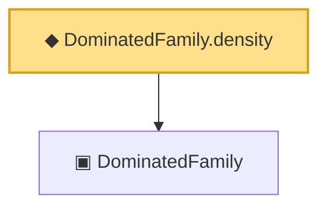

# Proof narrative — DominatedFamily.density

Root: **DominatedFamily.density** (noncomputable def) `Statlib/Sufficiency/DominatedFamily_density.lean:15` · topic `Sufficiency`
Closure: 2 declarations across 2 files. Generated from `proof_graph.json` — no files were moved.

Reading order (foundations first, headline last):

  ▣ `DominatedFamily` — structure · `Statlib/Sufficiency/DominatedFamily.lean:15`  _(also used by 8: DensityRatioCondition, DominatedFamily.mixtureDensity, DominatedFamily.mixtureRatio, …)_
◆ `DominatedFamily.density` — noncomputable def · `Statlib/Sufficiency/DominatedFamily_density.lean:15` **← headline**

## Dependency diagram

