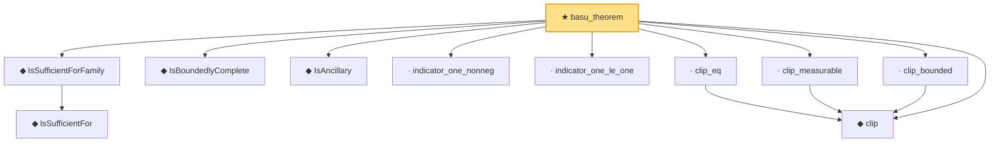

# Proof narrative — basu_theorem

Root: **basu_theorem** (theorem) `Statlib/Sufficiency/basu_theorem.lean:29` · topic `Sufficiency`
Closure: 11 declarations across 11 files. Generated from `proof_graph.json` — no files were moved.

Reading order (foundations first, headline last):

    ◆ `IsSufficientFor` — def · `Statlib/Sufficiency/IsSufficientFor.lean:17`  _(also used by 4: factorization_backward, factorization_forward, minimalSufficient_of_densityRatio, …)_
  ◆ `IsSufficientForFamily` — def · `Statlib/Sufficiency/IsSufficientForFamily.lean:16`
  ◆ `IsBoundedlyComplete` — def · `Statlib/Sufficiency/IsBoundedlyComplete.lean:17`
  ◆ `IsAncillary` — def · `Statlib/Sufficiency/IsAncillary.lean:16`
  · `indicator_one_nonneg` — lemma · `Statlib/Sufficiency/indicator_one_nonneg.lean:19`
  · `indicator_one_le_one` — lemma · `Statlib/Sufficiency/indicator_one_le_one.lean:18`
  ◆ `clip` — def · `Statlib/Sufficiency/clip.lean:18`
  · `clip_eq` — lemma · `Statlib/Sufficiency/clip_eq.lean:20`
  · `clip_measurable` — lemma · `Statlib/Sufficiency/clip_measurable.lean:19`
  · `clip_bounded` — lemma · `Statlib/Sufficiency/clip_bounded.lean:20`
★ `basu_theorem` — theorem · `Statlib/Sufficiency/basu_theorem.lean:29` **← headline**

## Dependency diagram

