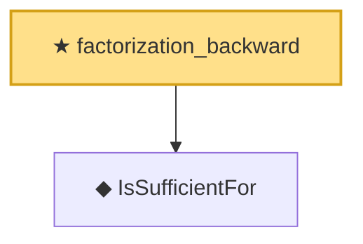

# Proof narrative — factorization_backward

Root: **factorization_backward** (theorem) `Statlib/Sufficiency/factorization_backward.lean:27` · topic `Sufficiency`
Closure: 2 declarations across 2 files. Generated from `proof_graph.json` — no files were moved.

Reading order (foundations first, headline last):

  ◆ `IsSufficientFor` — def · `Statlib/Sufficiency/IsSufficientFor.lean:17`  _(also used by 4: IsSufficientForFamily, factorization_forward, minimalSufficient_of_densityRatio, …)_
★ `factorization_backward` — theorem · `Statlib/Sufficiency/factorization_backward.lean:27` **← headline**

## Dependency diagram

