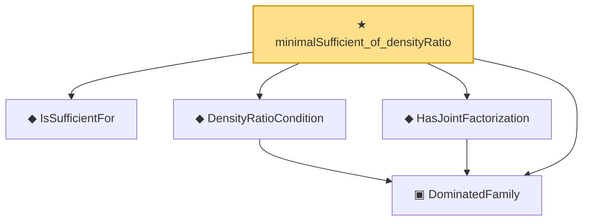

# Proof narrative — minimalSufficient_of_densityRatio

Root: **minimalSufficient_of_densityRatio** (theorem) `Statlib/Sufficiency/minimalSufficient_of_densityRatio.lean:21` · topic `Sufficiency`
Closure: 5 declarations across 5 files. Generated from `proof_graph.json` — no files were moved.

Reading order (foundations first, headline last):

  ▣ `DominatedFamily` — structure · `Statlib/Sufficiency/DominatedFamily.lean:15`  _(also used by 6: DominatedFamily.density, DominatedFamily.mixtureDensity, DominatedFamily.mixtureRatio, …)_
  ◆ `IsSufficientFor` — def · `Statlib/Sufficiency/IsSufficientFor.lean:17`  _(also used by 4: IsSufficientForFamily, factorization_backward, factorization_forward, …)_
  ◆ `DensityRatioCondition` — def · `Statlib/Sufficiency/DensityRatioCondition.lean:17`
  ◆ `HasJointFactorization` — def · `Statlib/Sufficiency/HasJointFactorization.lean:18`  _(also used by 1: mixtureRatio_minimalSufficient)_
★ `minimalSufficient_of_densityRatio` — theorem · `Statlib/Sufficiency/minimalSufficient_of_densityRatio.lean:21` **← headline**

## Dependency diagram

