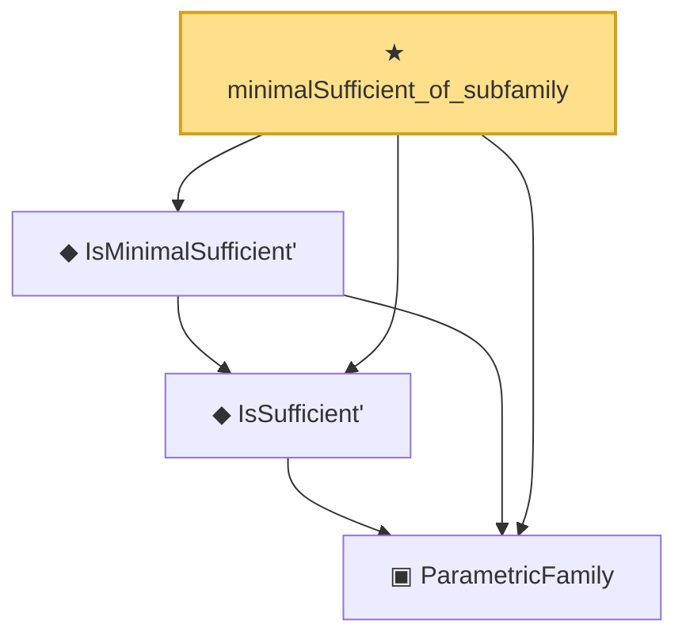

# Proof narrative — minimalSufficient_of_subfamily

Root: **minimalSufficient_of_subfamily** (theorem) `Statlib/Sufficiency/minimalSufficient_of_subfamily.lean:25` · topic `Sufficiency`
Closure: 4 declarations across 2 files. Generated from `proof_graph.json` — no files were moved.

Reading order (foundations first, headline last):

  ▣ `ParametricFamily` — structure · `Statlib/Statistic/Basic.lean:64`  _(also used by 44: CoverageProb, IsConfidenceInterval, IsConfidenceSet, …)_
  ◆ `IsSufficient'` — def · `Statlib/Statistic/Basic.lean:83`  _(also used by 2: condExp_eq_of_sufficient, lehmann_scheffe)_
  ◆ `IsMinimalSufficient'` — def · `Statlib/Statistic/Basic.lean:103`
★ `minimalSufficient_of_subfamily` — theorem · `Statlib/Sufficiency/minimalSufficient_of_subfamily.lean:25` **← headline**

## Dependency diagram

