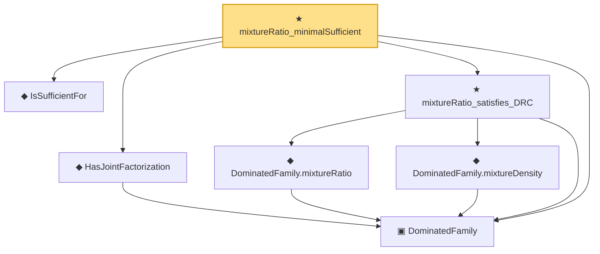

# Proof narrative — mixtureRatio_minimalSufficient

Root: **mixtureRatio_minimalSufficient** (theorem) `Statlib/Sufficiency/mixtureRatio_minimalSufficient.lean:30` · topic `Sufficiency`
Closure: 7 declarations across 7 files. Generated from `proof_graph.json` — no files were moved.

Reading order (foundations first, headline last):

  ▣ `DominatedFamily` — structure · `Statlib/Sufficiency/DominatedFamily.lean:15`  _(also used by 4: DensityRatioCondition, DominatedFamily.density, densityRatio_satisfies_DRC, …)_
  ◆ `IsSufficientFor` — def · `Statlib/Sufficiency/IsSufficientFor.lean:17`  _(also used by 4: IsSufficientForFamily, factorization_backward, factorization_forward, …)_
  ◆ `HasJointFactorization` — def · `Statlib/Sufficiency/HasJointFactorization.lean:18`  _(also used by 1: minimalSufficient_of_densityRatio)_
    ◆ `DominatedFamily.mixtureRatio` — noncomputable def · `Statlib/Sufficiency/DominatedFamily_mixtureRatio.lean:21`
    ◆ `DominatedFamily.mixtureDensity` — noncomputable def · `Statlib/Sufficiency/DominatedFamily_mixtureDensity.lean:39`
  ★ `mixtureRatio_satisfies_DRC` — theorem · `Statlib/Sufficiency/mixtureRatio_satisfies_DRC.lean:24`
★ `mixtureRatio_minimalSufficient` — theorem · `Statlib/Sufficiency/mixtureRatio_minimalSufficient.lean:30` **← headline**

## Dependency diagram

