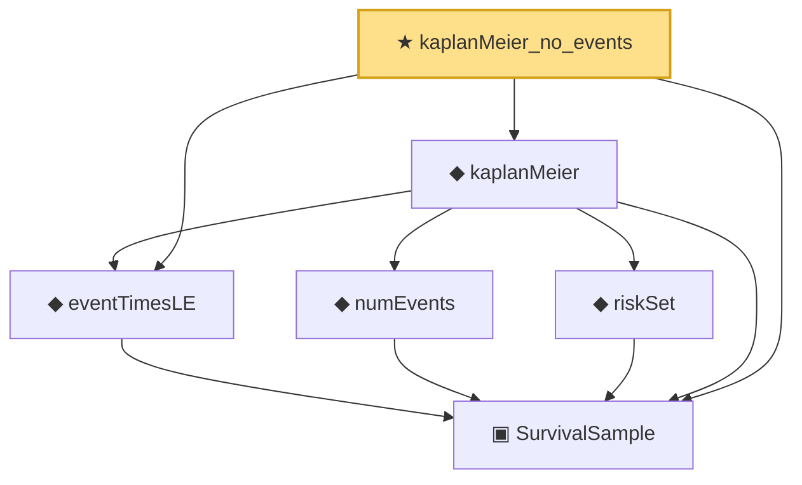

# Proof narrative — kaplanMeier_no_events

Root: **kaplanMeier_no_events** (theorem) `Statlib/Survival/kaplanMeier_no_events.lean:15` · topic `Survival`
Closure: 6 declarations across 6 files. Generated from `proof_graph.json` — no files were moved.

Reading order (foundations first, headline last):

  ▣ `SurvivalSample` — structure · `Statlib/Survival/SurvivalSample.lean:11`  _(also used by 3: greenwood_variance_formula, kaplanMeier_empty, riskSet_antitone)_
  ◆ `eventTimesLE` — noncomputable def · `Statlib/Survival/eventTimesLE.lean:11`  _(also used by 2: greenwood_variance_formula, kaplanMeier_empty)_
    ◆ `numEvents` — noncomputable def · `Statlib/Survival/numEvents.lean:11`  _(also used by 1: greenwood_variance_formula)_
    ◆ `riskSet` — noncomputable def · `Statlib/Survival/riskSet.lean:12`  _(also used by 2: greenwood_variance_formula, riskSet_antitone)_
  ◆ `kaplanMeier` — noncomputable def · `Statlib/Survival/kaplanMeier.lean:16`  _(also used by 2: greenwood_variance_formula, kaplanMeier_empty)_
★ `kaplanMeier_no_events` — theorem · `Statlib/Survival/kaplanMeier_no_events.lean:15` **← headline**

## Dependency diagram

