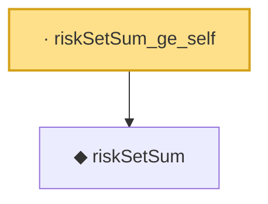

# Proof narrative — riskSetSum_ge_self

Root: **riskSetSum_ge_self** (lemma) `Statlib/Survival/riskSetSum_ge_self.lean:12` · topic `Survival`
Closure: 2 declarations across 2 files. Generated from `proof_graph.json` — no files were moved.

Reading order (foundations first, headline last):

  ◆ `riskSetSum` — noncomputable def · `Statlib/Survival/riskSetSum.lean:12`  _(also used by 3: coxPartialNeg, riskSetSum_nonneg, riskSetSum_pos)_
· `riskSetSum_ge_self` — lemma · `Statlib/Survival/riskSetSum_ge_self.lean:12` **← headline**

## Dependency diagram

