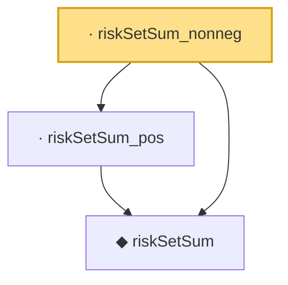

# Proof narrative — riskSetSum_nonneg

Root: **riskSetSum_nonneg** (lemma) `Statlib/Survival/riskSetSum_nonneg.lean:12` · topic `Survival`
Closure: 3 declarations across 3 files. Generated from `proof_graph.json` — no files were moved.

Reading order (foundations first, headline last):

  ◆ `riskSetSum` — noncomputable def · `Statlib/Survival/riskSetSum.lean:12`  _(also used by 2: coxPartialNeg, riskSetSum_ge_self)_
  · `riskSetSum_pos` — lemma · `Statlib/Survival/riskSetSum_pos.lean:12`
· `riskSetSum_nonneg` — lemma · `Statlib/Survival/riskSetSum_nonneg.lean:12` **← headline**

## Dependency diagram

