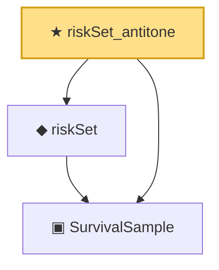

# Proof narrative — riskSet_antitone

Root: **riskSet_antitone** (theorem) `Statlib/Survival/riskSet_antitone.lean:13` · topic `Survival`
Closure: 3 declarations across 3 files. Generated from `proof_graph.json` — no files were moved.

Reading order (foundations first, headline last):

  ▣ `SurvivalSample` — structure · `Statlib/Survival/SurvivalSample.lean:11`  _(also used by 6: eventTimesLE, greenwood_variance_formula, kaplanMeier, …)_
  ◆ `riskSet` — noncomputable def · `Statlib/Survival/riskSet.lean:12`  _(also used by 2: greenwood_variance_formula, kaplanMeier)_
★ `riskSet_antitone` — theorem · `Statlib/Survival/riskSet_antitone.lean:13` **← headline**

## Dependency diagram

