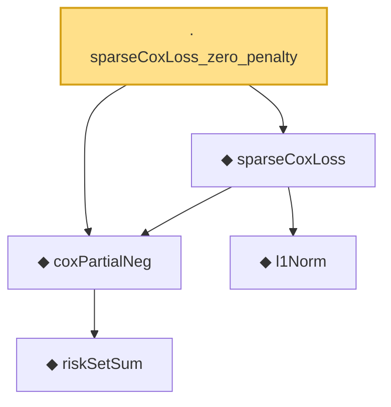

# Proof narrative — sparseCoxLoss_zero_penalty

Root: **sparseCoxLoss_zero_penalty** (lemma) `Statlib/Survival/sparseCoxLoss_zero_penalty.lean:13` · topic `Survival`
Closure: 5 declarations across 5 files. Generated from `proof_graph.json` — no files were moved.

Reading order (foundations first, headline last):

      ◆ `riskSetSum` — noncomputable def · `Statlib/Survival/riskSetSum.lean:12`  _(also used by 3: riskSetSum_ge_self, riskSetSum_nonneg, riskSetSum_pos)_
  ◆ `coxPartialNeg` — noncomputable def · `Statlib/Survival/coxPartialNeg.lean:13`  _(also used by 1: sparseCoxLoss_eq)_
    ◆ `l1Norm` — def · `Statlib/Regression/l1Norm.lean:15`  _(also used by 25: IsDantzigSelector, IsDantzigSelector.l1_le_truth, IsSqrtLassoEstimator.l1_diff_bound, …)_
  ◆ `sparseCoxLoss` — noncomputable def · `Statlib/Survival/sparseCoxLoss.lean:12`  _(also used by 3: IsSparseCoxEstimator, IsSparseCoxEstimator.le_at, sparseCoxLoss_eq)_
· `sparseCoxLoss_zero_penalty` — lemma · `Statlib/Survival/sparseCoxLoss_zero_penalty.lean:13` **← headline**

## Dependency diagram

