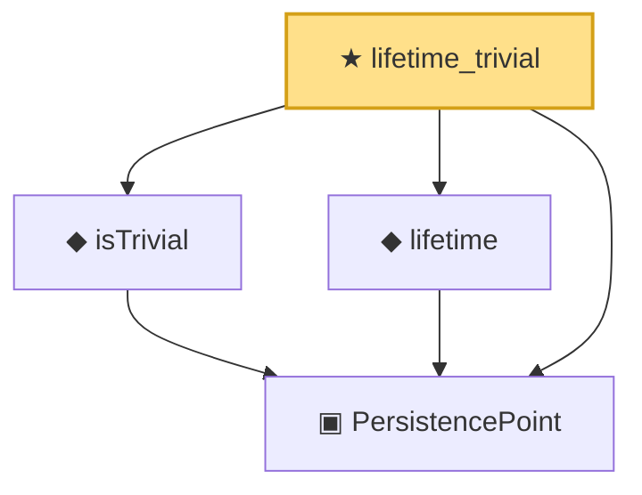

# Proof narrative — lifetime_trivial

Root: **lifetime_trivial** (theorem) `Statlib/TDA/lifetime_trivial.lean:15` · topic `TDA`
Closure: 4 declarations across 4 files. Generated from `proof_graph.json` — no files were moved.

Reading order (foundations first, headline last):

  ▣ `PersistencePoint` — structure · `Statlib/TDA/PersistencePoint.lean:13`  _(also used by 1: PersistenceDiagram)_
  ◆ `isTrivial` — def · `Statlib/TDA/isTrivial.lean:14`
  ◆ `lifetime` — noncomputable def · `Statlib/TDA/lifetime.lean:14`
★ `lifetime_trivial` — theorem · `Statlib/TDA/lifetime_trivial.lean:15` **← headline**

## Dependency diagram

