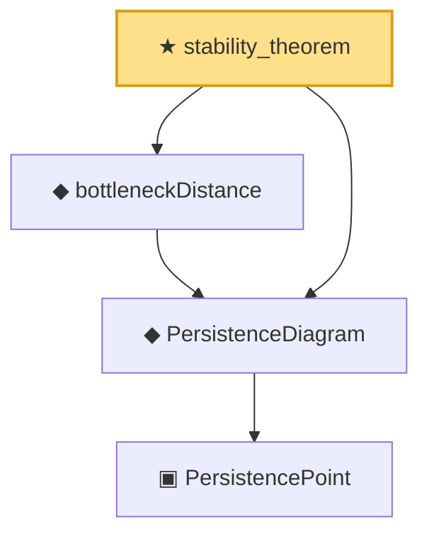

# Proof narrative — stability_theorem

Root: **stability_theorem** (theorem) `Statlib/TDA/stability_theorem.lean:23` · topic `TDA`
Closure: 4 declarations across 4 files. Generated from `proof_graph.json` — no files were moved.

Reading order (foundations first, headline last):

    ▣ `PersistencePoint` — structure · `Statlib/TDA/PersistencePoint.lean:13`  _(also used by 3: isTrivial, lifetime, lifetime_trivial)_
  ◆ `PersistenceDiagram` — abbrev · `Statlib/TDA/PersistenceDiagram.lean:14`  _(also used by 3: Statlib.TDA.stability_theorem_axiom, bottleneckDistance_comm, bottleneckDistance_nonneg)_
  ◆ `bottleneckDistance` — noncomputable def · `Statlib/TDA/bottleneckDistance.lean:22`  _(also used by 3: Statlib.TDA.stability_theorem_axiom, bottleneckDistance_comm, bottleneckDistance_nonneg)_
★ `stability_theorem` — theorem · `Statlib/TDA/stability_theorem.lean:23` **← headline**

## Dependency diagram

