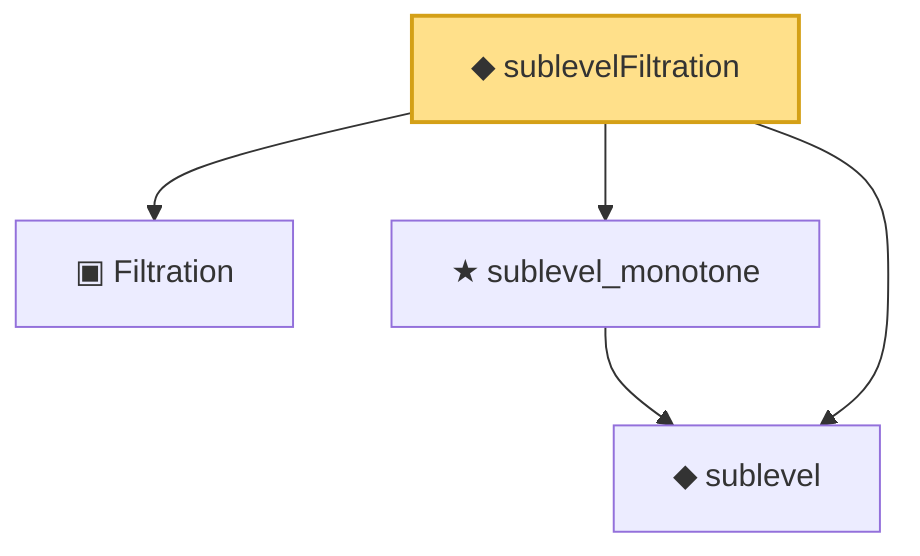

# Proof narrative — sublevelFiltration

Root: **sublevelFiltration** (def) `Statlib/TDA/sublevelFiltration.lean:13` · topic `TDA`
Closure: 4 declarations across 4 files. Generated from `proof_graph.json` — no files were moved.

Reading order (foundations first, headline last):

  ▣ `Filtration` — structure · `Statlib/TDA/Filtration.lean:12`
  ◆ `sublevel` — def · `Statlib/TDA/sublevel.lean:11`
  ★ `sublevel_monotone` — theorem · `Statlib/TDA/sublevel_monotone.lean:11`
◆ `sublevelFiltration` — def · `Statlib/TDA/sublevelFiltration.lean:13` **← headline**

## Dependency diagram

