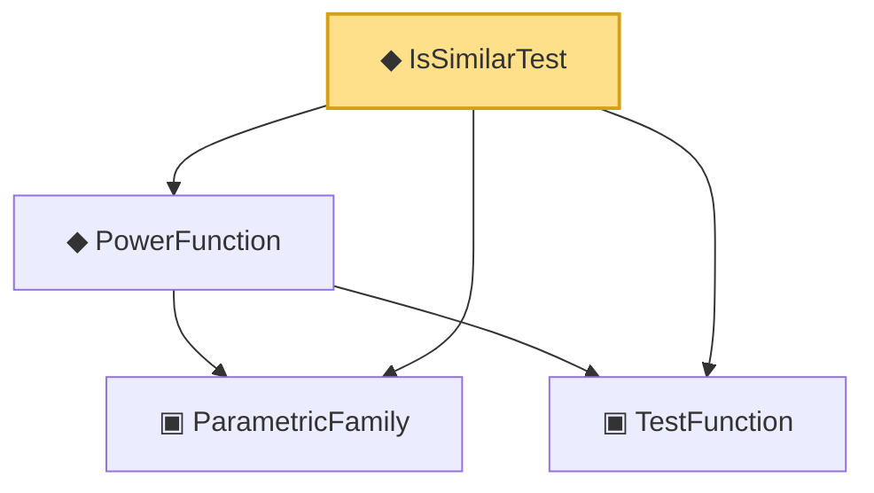

# Proof narrative — IsSimilarTest

Root: **IsSimilarTest** (def) `Statlib/Testing/IsSimilarTest.lean:15` · topic `Testing`
Closure: 4 declarations across 4 files. Generated from `proof_graph.json` — no files were moved.

Reading order (foundations first, headline last):

  ▣ `ParametricFamily` — structure · `Statlib/Statistic/Basic.lean:64`  _(also used by 45: CoverageProb, IsConfidenceInterval, IsConfidenceSet, …)_
  ▣ `TestFunction` — structure · `Statlib/Testing/TestFunction.lean:12`  _(also used by 10: HasLevel, IsUMP, IsUMPU, …)_
  ◆ `PowerFunction` — noncomputable def · `Statlib/Testing/PowerFunction.lean:12`  _(also used by 9: IsUMP, IsUMPU, IsUnbiasedTest, …)_
◆ `IsSimilarTest` — def · `Statlib/Testing/IsSimilarTest.lean:15` **← headline**

## Dependency diagram

