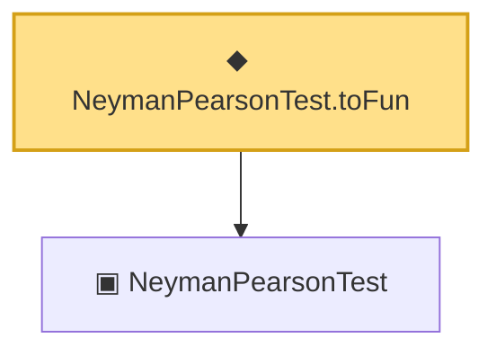

# Proof narrative — NeymanPearsonTest.toFun

Root: **NeymanPearsonTest.toFun** (noncomputable def) `Statlib/Testing/NeymanPearsonTest_toFun.lean:14` · topic `Testing`
Closure: 2 declarations across 2 files. Generated from `proof_graph.json` — no files were moved.

Reading order (foundations first, headline last):

  ▣ `NeymanPearsonTest` — structure · `Statlib/Testing/NeymanPearsonTest.lean:14`
◆ `NeymanPearsonTest.toFun` — noncomputable def · `Statlib/Testing/NeymanPearsonTest_toFun.lean:14` **← headline**

## Dependency diagram

