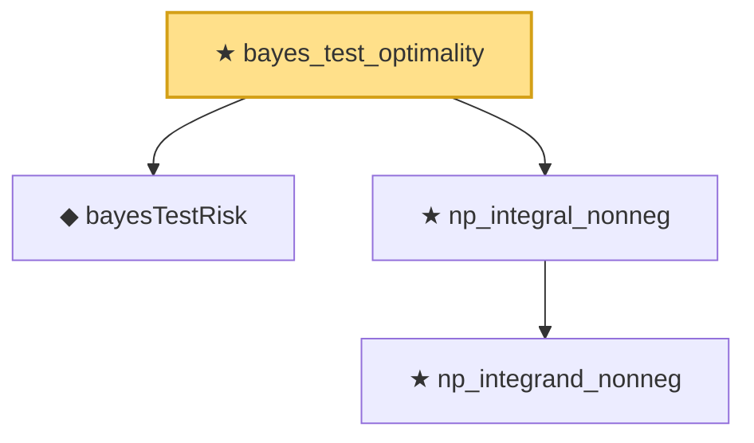

# Proof narrative — bayes_test_optimality

Root: **bayes_test_optimality** (theorem) `Statlib/Testing/bayes_test_optimality.lean:22` · topic `Testing`
Closure: 4 declarations across 4 files. Generated from `proof_graph.json` — no files were moved.

Reading order (foundations first, headline last):

  ◆ `bayesTestRisk` — noncomputable def · `Statlib/Testing/bayesTestRisk.lean:14`
    ★ `np_integrand_nonneg` — theorem · `Statlib/Testing/np_integrand_nonneg.lean:16`
  ★ `np_integral_nonneg` — theorem · `Statlib/Testing/np_integral_nonneg.lean:16`  _(also used by 1: neyman_pearson_optimality)_
★ `bayes_test_optimality` — theorem · `Statlib/Testing/bayes_test_optimality.lean:22` **← headline**

## Dependency diagram

