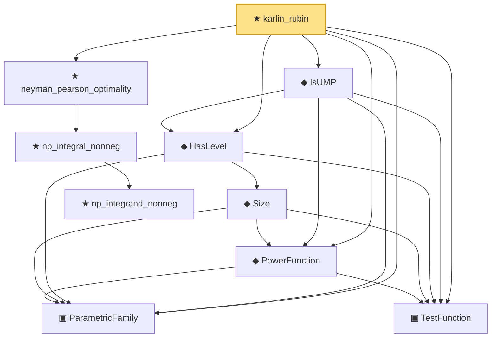

# Proof narrative — karlin_rubin

Root: **karlin_rubin** (theorem) `Statlib/Testing/karlin_rubin.lean:30` · topic `Testing`
Closure: 10 declarations across 10 files. Generated from `proof_graph.json` — no files were moved.

Reading order (foundations first, headline last):

  ▣ `ParametricFamily` — structure · `Statlib/Statistic/Basic.lean:64`  _(also used by 42: CoverageProb, IsConfidenceInterval, IsConfidenceSet, …)_
  ▣ `TestFunction` — structure · `Statlib/Testing/TestFunction.lean:12`  _(also used by 7: IsSimilarTest, IsUMPU, IsUnbiasedTest, …)_
  ◆ `PowerFunction` — noncomputable def · `Statlib/Testing/PowerFunction.lean:12`  _(also used by 7: IsSimilarTest, IsUMPU, IsUnbiasedTest, …)_
    ◆ `Size` — noncomputable def · `Statlib/Testing/Size.lean:13`
  ◆ `HasLevel` — def · `Statlib/Testing/HasLevel.lean:12`  _(also used by 2: IsUnbiasedTest, ump_unbiased_iff_umpu)_
  ◆ `IsUMP` — def · `Statlib/Testing/IsUMP.lean:15`
      ★ `np_integrand_nonneg` — theorem · `Statlib/Testing/np_integrand_nonneg.lean:16`
    ★ `np_integral_nonneg` — theorem · `Statlib/Testing/np_integral_nonneg.lean:16`  _(also used by 1: bayes_test_optimality)_
  ★ `neyman_pearson_optimality` — theorem · `Statlib/Testing/neyman_pearson_optimality.lean:19`
★ `karlin_rubin` — theorem · `Statlib/Testing/karlin_rubin.lean:30` **← headline**

## Dependency diagram

