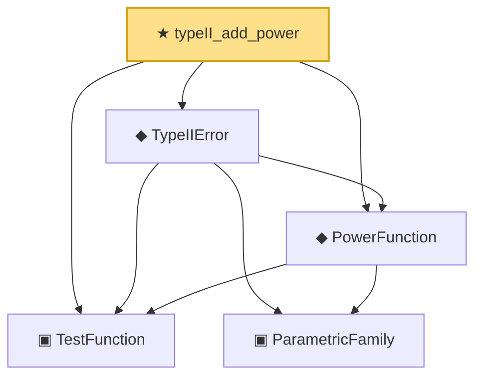

# Proof narrative — typeII_add_power

Root: **typeII_add_power** (theorem) `Statlib/Testing/typeII_add_power.lean:16` · topic `Testing`
Closure: 5 declarations across 5 files. Generated from `proof_graph.json` — no files were moved.

Reading order (foundations first, headline last):

  ▣ `TestFunction` — structure · `Statlib/Testing/TestFunction.lean:12`  _(also used by 9: HasLevel, IsSimilarTest, IsUMP, …)_
    ▣ `ParametricFamily` — structure · `Statlib/Statistic/Basic.lean:64`  _(also used by 45: CoverageProb, IsConfidenceInterval, IsConfidenceSet, …)_
  ◆ `PowerFunction` — noncomputable def · `Statlib/Testing/PowerFunction.lean:12`  _(also used by 8: IsSimilarTest, IsUMP, IsUMPU, …)_
  ◆ `TypeIIError` — noncomputable def · `Statlib/Testing/TypeIIError.lean:13`
★ `typeII_add_power` — theorem · `Statlib/Testing/typeII_add_power.lean:16` **← headline**

## Dependency diagram

