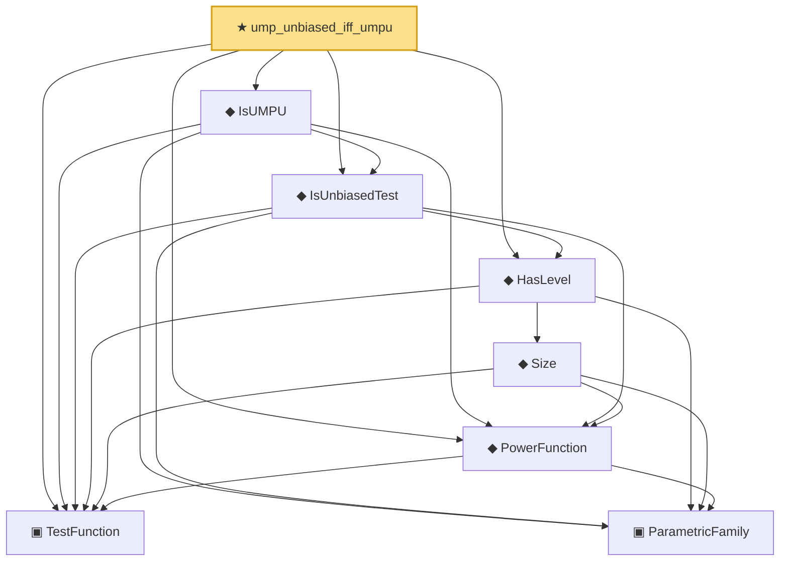

# Proof narrative — ump_unbiased_iff_umpu

Root: **ump_unbiased_iff_umpu** (theorem) `Statlib/Testing/ump_unbiased_iff_umpu.lean:18` · topic `Testing`
Closure: 8 declarations across 8 files. Generated from `proof_graph.json` — no files were moved.

Reading order (foundations first, headline last):

  ▣ `TestFunction` — structure · `Statlib/Testing/TestFunction.lean:12`  _(also used by 6: IsSimilarTest, IsUMP, TypeIError, …)_
    ▣ `ParametricFamily` — structure · `Statlib/Statistic/Basic.lean:64`  _(also used by 42: CoverageProb, IsConfidenceInterval, IsConfidenceSet, …)_
  ◆ `PowerFunction` — noncomputable def · `Statlib/Testing/PowerFunction.lean:12`  _(also used by 6: IsSimilarTest, IsUMP, TypeIError, …)_
      ◆ `Size` — noncomputable def · `Statlib/Testing/Size.lean:13`
  ◆ `HasLevel` — def · `Statlib/Testing/HasLevel.lean:12`  _(also used by 2: IsUMP, karlin_rubin)_
  ◆ `IsUnbiasedTest` — def · `Statlib/Testing/IsUnbiasedTest.lean:16`
  ◆ `IsUMPU` — def · `Statlib/Testing/IsUMPU.lean:17`
★ `ump_unbiased_iff_umpu` — theorem · `Statlib/Testing/ump_unbiased_iff_umpu.lean:18` **← headline**

## Dependency diagram

