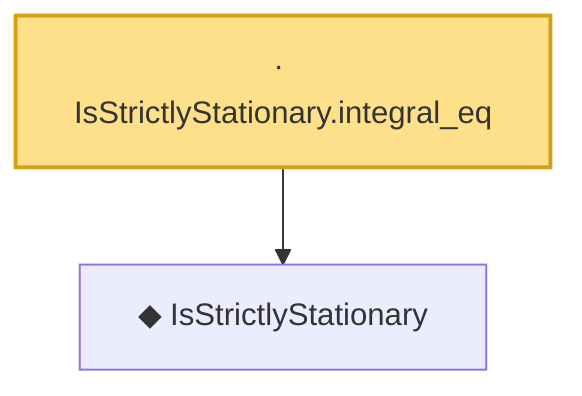

# Proof narrative — IsStrictlyStationary.integral_eq

Root: **IsStrictlyStationary.integral_eq** (lemma) `Statlib/TimeSeries/IsStrictlyStationary_integral_eq.lean:13` · topic `TimeSeries`
Closure: 2 declarations across 2 files. Generated from `proof_graph.json` — no files were moved.

Reading order (foundations first, headline last):

  ◆ `IsStrictlyStationary` — def · `Statlib/TimeSeries/IsStrictlyStationary.lean:16`  _(also used by 8: IsStrictlyStationary.map_eq_of_single, ar1_stationary_iff, ar1_stationary_iff_axiom, …)_
· `IsStrictlyStationary.integral_eq` — lemma · `Statlib/TimeSeries/IsStrictlyStationary_integral_eq.lean:13` **← headline**

## Dependency diagram

