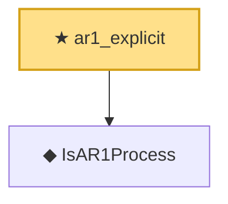

# Proof narrative — ar1_explicit

Root: **ar1_explicit** (theorem) `Statlib/TimeSeries/ar1_explicit.lean:17` · topic `TimeSeries`
Closure: 2 declarations across 2 files. Generated from `proof_graph.json` — no files were moved.

Reading order (foundations first, headline last):

  ◆ `IsAR1Process` — def · `Statlib/TimeSeries/IsAR1Process.lean:12`  _(also used by 3: ar1_stationary_iff, ar1_stationary_iff_axiom, ar1_zero_eq_noise)_
★ `ar1_explicit` — theorem · `Statlib/TimeSeries/ar1_explicit.lean:17` **← headline**

## Dependency diagram

