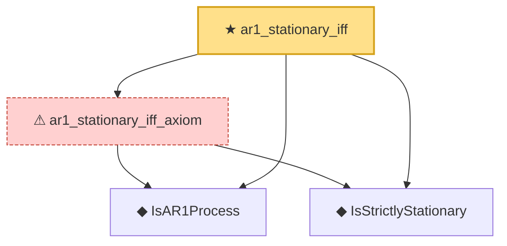

# Proof narrative — ar1_stationary_iff

Root: **ar1_stationary_iff** (theorem) `Statlib/TimeSeries/ar1_stationary_iff.lean:19` · topic `TimeSeries`
Closure: 4 declarations across 4 files. Generated from `proof_graph.json` — no files were moved.

Reading order (foundations first, headline last):

  ◆ `IsAR1Process` — def · `Statlib/TimeSeries/IsAR1Process.lean:12`  _(also used by 2: ar1_explicit, ar1_zero_eq_noise)_
  ◆ `IsStrictlyStationary` — def · `Statlib/TimeSeries/IsStrictlyStationary.lean:16`  _(also used by 7: IsStrictlyStationary.integral_eq, IsStrictlyStationary.map_eq_of_single, isStrictlyStationary_birkhoff, …)_
  ⚠ `ar1_stationary_iff_axiom` — axiom · `Statlib/TimeSeries/ar1_stationary_iff_axiom.lean:27`
★ `ar1_stationary_iff` — theorem · `Statlib/TimeSeries/ar1_stationary_iff.lean:19` **← headline**

## Dependency diagram

