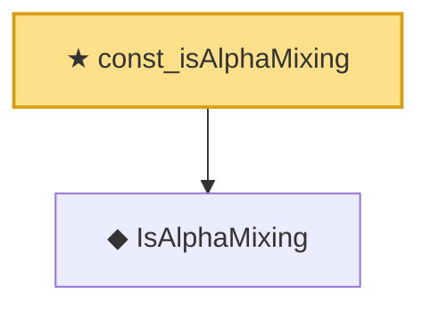

# Proof narrative — const_isAlphaMixing

Root: **const_isAlphaMixing** (theorem) `Statlib/TimeSeries/const_isAlphaMixing.lean:16` · topic `TimeSeries`
Closure: 2 declarations across 2 files. Generated from `proof_graph.json` — no files were moved.

Reading order (foundations first, headline last):

  ◆ `IsAlphaMixing` — def · `Statlib/TimeSeries/IsAlphaMixing.lean:11`  _(also used by 1: iid_isAlphaMixing)_
★ `const_isAlphaMixing` — theorem · `Statlib/TimeSeries/const_isAlphaMixing.lean:16` **← headline**

## Dependency diagram

