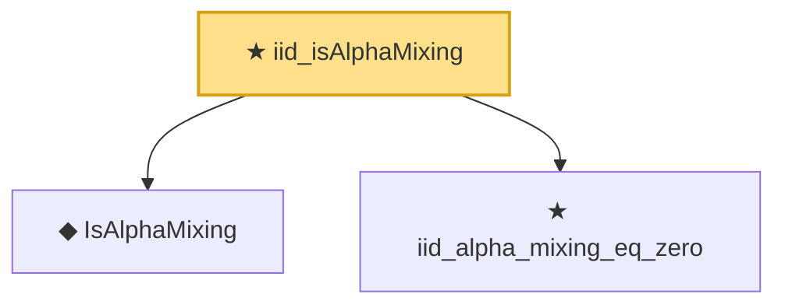

# Proof narrative — iid_isAlphaMixing

Root: **iid_isAlphaMixing** (theorem) `Statlib/TimeSeries/iid_isAlphaMixing.lean:18` · topic `TimeSeries`
Closure: 3 declarations across 3 files. Generated from `proof_graph.json` — no files were moved.

Reading order (foundations first, headline last):

  ◆ `IsAlphaMixing` — def · `Statlib/TimeSeries/IsAlphaMixing.lean:11`  _(also used by 1: const_isAlphaMixing)_
  ★ `iid_alpha_mixing_eq_zero` — theorem · `Statlib/TimeSeries/iid_alpha_mixing_eq_zero.lean:18`
★ `iid_isAlphaMixing` — theorem · `Statlib/TimeSeries/iid_isAlphaMixing.lean:18` **← headline**

## Dependency diagram

