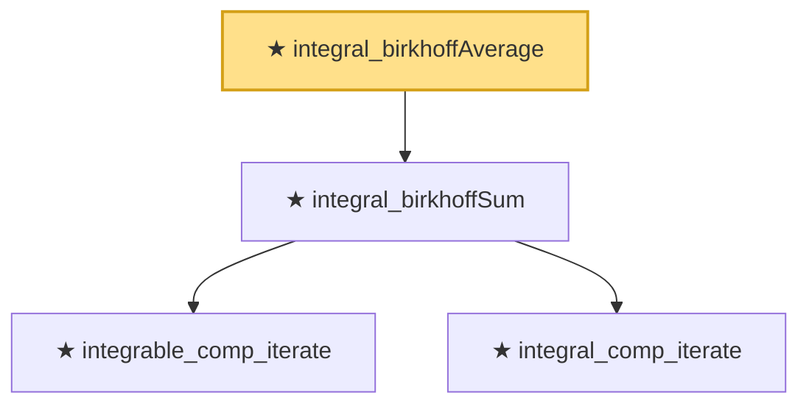

# Proof narrative — integral_birkhoffAverage

Root: **integral_birkhoffAverage** (theorem) `Statlib/TimeSeries/integral_birkhoffAverage.lean:14` · topic `TimeSeries`
Closure: 4 declarations across 4 files. Generated from `proof_graph.json` — no files were moved.

Reading order (foundations first, headline last):

    ★ `integrable_comp_iterate` — theorem · `Statlib/TimeSeries/integrable_comp_iterate.lean:10`
    ★ `integral_comp_iterate` — theorem · `Statlib/TimeSeries/integral_comp_iterate.lean:10`
  ★ `integral_birkhoffSum` — theorem · `Statlib/TimeSeries/integral_birkhoffSum.lean:16`
★ `integral_birkhoffAverage` — theorem · `Statlib/TimeSeries/integral_birkhoffAverage.lean:14` **← headline**

## Dependency diagram

