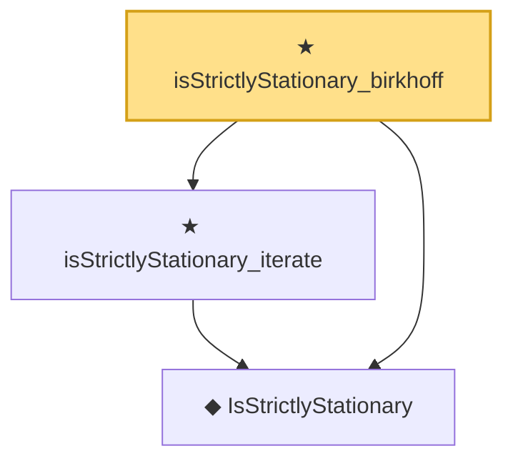

# Proof narrative — isStrictlyStationary_birkhoff

Root: **isStrictlyStationary_birkhoff** (theorem) `Statlib/TimeSeries/isStrictlyStationary_birkhoff.lean:15` · topic `TimeSeries`
Closure: 3 declarations across 3 files. Generated from `proof_graph.json` — no files were moved.

Reading order (foundations first, headline last):

  ◆ `IsStrictlyStationary` — def · `Statlib/TimeSeries/IsStrictlyStationary.lean:16`  _(also used by 7: IsStrictlyStationary.integral_eq, IsStrictlyStationary.map_eq_of_single, ar1_stationary_iff, …)_
  ★ `isStrictlyStationary_iterate` — theorem · `Statlib/TimeSeries/isStrictlyStationary_iterate.lean:17`
★ `isStrictlyStationary_birkhoff` — theorem · `Statlib/TimeSeries/isStrictlyStationary_birkhoff.lean:15` **← headline**

## Dependency diagram

