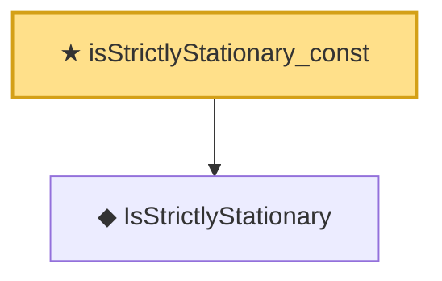

# Proof narrative — isStrictlyStationary_const

Root: **isStrictlyStationary_const** (theorem) `Statlib/TimeSeries/isStrictlyStationary_const.lean:11` · topic `TimeSeries`
Closure: 2 declarations across 2 files. Generated from `proof_graph.json` — no files were moved.

Reading order (foundations first, headline last):

  ◆ `IsStrictlyStationary` — def · `Statlib/TimeSeries/IsStrictlyStationary.lean:16`  _(also used by 8: IsStrictlyStationary.integral_eq, IsStrictlyStationary.map_eq_of_single, ar1_stationary_iff, …)_
★ `isStrictlyStationary_const` — theorem · `Statlib/TimeSeries/isStrictlyStationary_const.lean:11` **← headline**

## Dependency diagram

