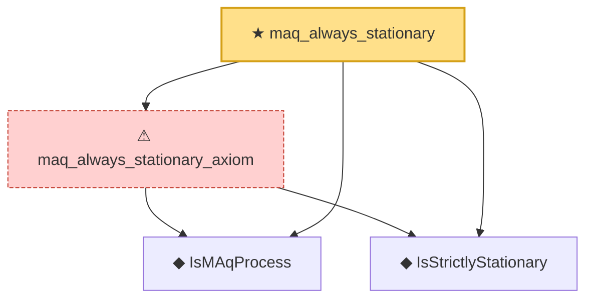

# Proof narrative — maq_always_stationary

Root: **maq_always_stationary** (theorem) `Statlib/TimeSeries/maq_always_stationary.lean:18` · topic `TimeSeries`
Closure: 4 declarations across 4 files. Generated from `proof_graph.json` — no files were moved.

Reading order (foundations first, headline last):

  ◆ `IsMAqProcess` — def · `Statlib/TimeSeries/IsMAqProcess.lean:12`
  ◆ `IsStrictlyStationary` — def · `Statlib/TimeSeries/IsStrictlyStationary.lean:16`  _(also used by 7: IsStrictlyStationary.integral_eq, IsStrictlyStationary.map_eq_of_single, ar1_stationary_iff, …)_
  ⚠ `maq_always_stationary_axiom` — axiom · `Statlib/TimeSeries/maq_always_stationary_axiom.lean:19`
★ `maq_always_stationary` — theorem · `Statlib/TimeSeries/maq_always_stationary.lean:18` **← headline**

## Dependency diagram

