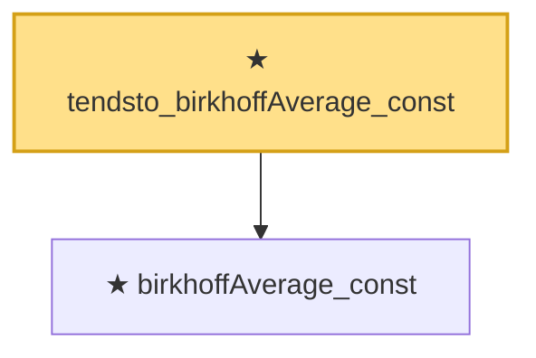

# Proof narrative — tendsto_birkhoffAverage_const

Root: **tendsto_birkhoffAverage_const** (theorem) `Statlib/TimeSeries/tendsto_birkhoffAverage_const.lean:13` · topic `TimeSeries`
Closure: 2 declarations across 2 files. Generated from `proof_graph.json` — no files were moved.

Reading order (foundations first, headline last):

  ★ `birkhoffAverage_const` — theorem · `Statlib/TimeSeries/birkhoffAverage_const.lean:12`
★ `tendsto_birkhoffAverage_const` — theorem · `Statlib/TimeSeries/tendsto_birkhoffAverage_const.lean:13` **← headline**

## Dependency diagram

