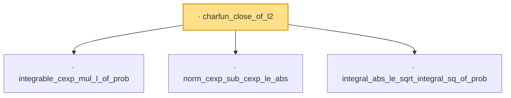

# Proof narrative — charfun_close_of_l2

Root: **charfun_close_of_l2** (lemma) `Statlib/Variance/charfun_close_of_l2.lean:38` · topic `Variance`
Closure: 4 declarations across 4 files. Generated from `proof_graph.json` — no files were moved.

Reading order (foundations first, headline last):

  · `integrable_cexp_mul_I_of_prob` — lemma · `Statlib/Variance/integrable_cexp_mul_I_of_prob.lean:33`  _(also used by 1: charfun_close_per_step)_
  · `norm_cexp_sub_cexp_le_abs` — lemma · `Statlib/Variance/norm_cexp_sub_cexp_le_abs.lean:42`  _(also used by 1: charfun_close_per_step)_
  · `integral_abs_le_sqrt_integral_sq_of_prob` — lemma · `Statlib/Variance/integral_abs_le_sqrt_integral_sq_of_prob.lean:33`  _(also used by 1: charfun_close_per_step)_
· `charfun_close_of_l2` — lemma · `Statlib/Variance/charfun_close_of_l2.lean:38` **← headline**

## Dependency diagram

