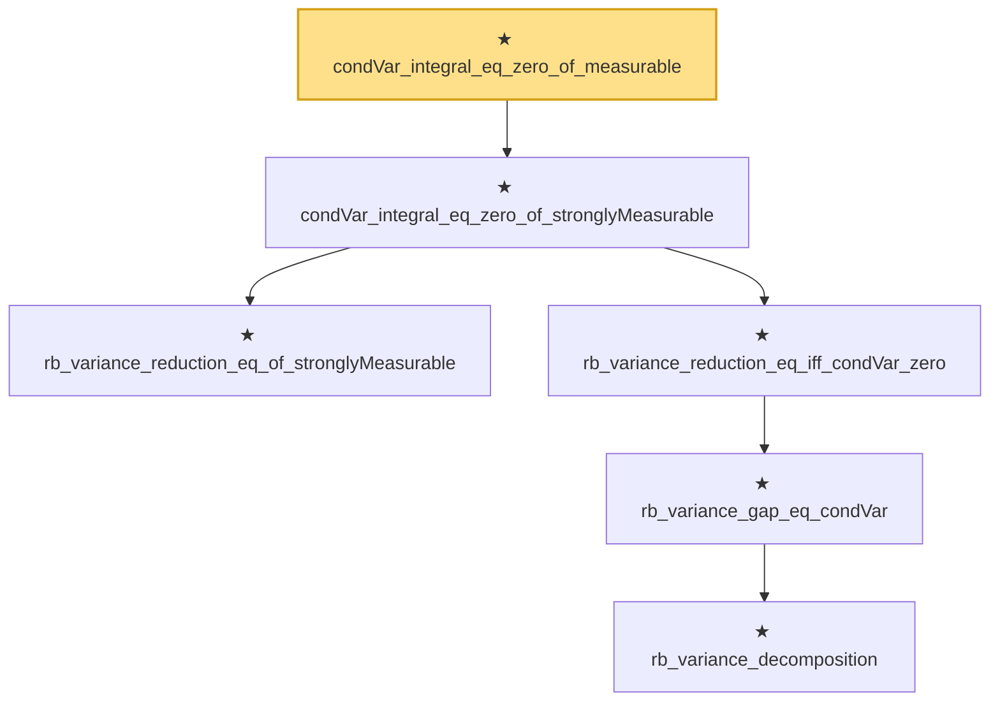

# Proof narrative — condVar_integral_eq_zero_of_measurable

Root: **condVar_integral_eq_zero_of_measurable** (theorem) `Statlib/Variance/condVar_integral_eq_zero_of_measurable.lean:11` · topic `Variance`
Closure: 6 declarations across 6 files. Generated from `proof_graph.json` — no files were moved.

Reading order (foundations first, headline last):

    ★ `rb_variance_reduction_eq_of_stronglyMeasurable` — theorem · `Statlib/Variance/rb_variance_reduction_eq_of_stronglyMeasurable.lean:10`  _(also used by 1: rb_variance_reduction_eq_of_measurable)_
        ★ `rb_variance_decomposition` — theorem · `Statlib/Variance/rb_variance_decomposition.lean:11`  _(also used by 1: rb_variance_reduction)_
      ★ `rb_variance_gap_eq_condVar` — theorem · `Statlib/Variance/rb_variance_gap_eq_condVar.lean:12`  _(also used by 1: rb_variance_gap_nonneg)_
    ★ `rb_variance_reduction_eq_iff_condVar_zero` — theorem · `Statlib/Variance/rb_variance_reduction_eq_iff_condVar_zero.lean:11`  _(also used by 1: rb_mse_reduction_eq_iff_variance_reduction_eq)_
  ★ `condVar_integral_eq_zero_of_stronglyMeasurable` — theorem · `Statlib/Variance/condVar_integral_eq_zero_of_stronglyMeasurable.lean:12`
★ `condVar_integral_eq_zero_of_measurable` — theorem · `Statlib/Variance/condVar_integral_eq_zero_of_measurable.lean:11` **← headline**

## Dependency diagram

