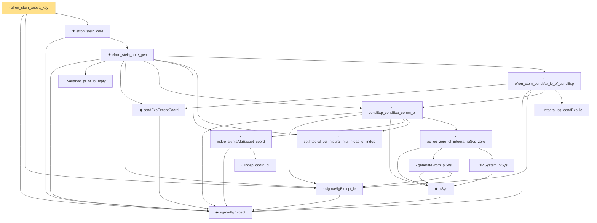

# Proof narrative — efron_stein_anova_key

Root: **efron_stein_anova_key** (lemma) `Statlib/Variance/efron_stein_anova_key.lean:22` · topic `Variance`
Closure: 17 declarations across 17 files. Generated from `proof_graph.json` — no files were moved.

Reading order (foundations first, headline last):

  ◆ `sigmaAlgExcept` — def · `Statlib/Variance/sigmaAlgExcept.lean:20`  _(also used by 14: gaussian_poincare_of_condVar_sum, condExp_eq_fiberAvg_pi, condVar_le_condExp_gradf_sq_ae_succ, …)_
  · `sigmaAlgExcept_le` — lemma · `Statlib/Variance/sigmaAlgExcept_le.lean:22`  _(also used by 4: condExp_eq_fiberAvg_pi, condVar_le_condExp_gradf_sq_ae_succ, gaussian_poincare_coord_bound_core, …)_
      · `variance_pi_of_isEmpty` — lemma · `Statlib/Variance/variance_pi_of_isEmpty.lean:17`  _(also used by 1: efron_stein_isEmpty)_
      ◆ `condExpExceptCoord` — def · `Statlib/Variance/condExpExceptCoord.lean:21`  _(also used by 13: gaussian_poincare_of_efron_stein, gaussian_poincare_of_condVar_sum, gaussian_poincare_coord_bound_core, …)_
        ◆ `piSys` — def · `Statlib/Variance/piSys.lean:22`
          · `iIndep_coord_pi` — lemma · `Statlib/Variance/iIndep_coord_pi.lean:22`
      · `indep_sigmaAlgExcept_coord` — lemma · `Statlib/Variance/indep_sigmaAlgExcept_coord.lean:24`
      · `setIntegral_eq_integral_mul_meas_of_indep` — lemma · `Statlib/Variance/setIntegral_eq_integral_mul_meas_of_indep.lean:22`
          · `generateFrom_piSys` — lemma · `Statlib/Variance/generateFrom_piSys.lean:25`
          · `isPiSystem_piSys` — lemma · `Statlib/Variance/isPiSystem_piSys.lean:21`
        · `ae_eq_zero_of_integral_piSys_zero` — lemma · `Statlib/Variance/ae_eq_zero_of_integral_piSys_zero.lean:25`
      · `condExp_condExp_comm_pi` — lemma · `Statlib/Variance/condExp_condExp_comm_pi.lean:29`
        · `integral_sq_condExp_le` — lemma · `Statlib/Variance/integral_sq_condExp_le.lean:43`
      · `efron_stein_condVar_le_of_condExp` — lemma · `Statlib/Variance/efron_stein_condVar_le_of_condExp.lean:24`
    ★ `efron_stein_core_gen` — theorem · `Statlib/Variance/efron_stein_core_gen.lean:29`
  ★ `efron_stein_core` — theorem · `Statlib/Variance/efron_stein_core.lean:21`  _(also used by 1: efron_stein)_
· `efron_stein_anova_key` — lemma · `Statlib/Variance/efron_stein_anova_key.lean:22` **← headline**

## Dependency diagram

